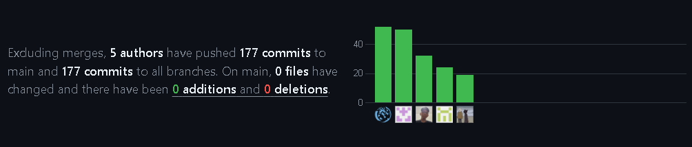
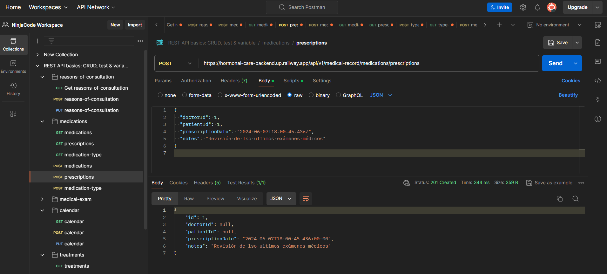

  

<h1 align="center">Universidad Peruana de Ciencias Aplicadas</h1>

<h2 align="center">Ingeniería de Software</h2>
<h3 align="center">Ciclo 2024-01</h3>

<h1 align="center">Desarrollo de Aplicaciones Open Source</h1>

<h2 align="center">TF REPORT</h2>

<strong>Sección:</strong> SW51

<strong>Profesor:</strong> Angel Augusto Velasquez Nuñez

<strong>StartUp Name:</strong> NinjaCode

<strong>Producto:</strong> HormonalCare

<h3 align="center">Team Members:</h3>

| Member                            |    Code    |
| :-------------------------------- | :--------: |
| Claudio Sandro Quispesivana Torres| U202215099 |
| Jherson David Astuyauri Calderon  | U202218451 |
| Estefano Sebastian Lostaunau Pereira | U202211742 |
| Luis Sebastian Chinchihualpa Saldarriaga | U202212112 |
| Sebastian Valente Lobato Pozo | U202215312 |

## Registro de versiones del informe

| Versión |    Fecha   |    Autor   |    Descripción de la modificación    |
|:-----:|:--------:|:--------:|:--------:|
| TB1     | 11/04/2024 | NinjaCode | Para esta entrega se desarrollaron los capítulos I, II, III, IV y V, y se desplegó la primera versión de la landing page |
| TP1     | 01/05/2024 | NinjaCode | Se corrigieron detalles del informe como problem statement, assumptions, student outcome, resumen del registro de entrevistas, user personas, user task matrix, ubiquitous language, product backlog, Web Applications Wireflow Diagrams, class diagrams, database diagrams. Se hizo el sprint 2 y se desarrolló la primera versión de la Web Application |
| TP1 v1.0.1     | 10/05/2024 | NinjaCode | Se llevaron a cabo algunos avances del frontend. |
| TP1 v1.0.2    | 20/05/2024 | NinjaCode | Se implementaron algunos servicios externos. |
| TB2     | 06/06/2024 | NinjaCode | Se llevó a cabo la segunda versión de la implementación del frontend y la primera versión del backend de HormonalCare. |
| TB2 v1.0.1    | 15/06/2024 | NinjaCode | Se implementó la segunda versión del backend de la aplicación junto a correciones de la BD. |
| TB2 v1.0.2    | 22/06/2024 | NinjaCode | Se llegaron a conectar algunas funcionalidades del frontend con el backend, adaptando el frontend. |
| TF   | 24/06/2024 | NinjaCode | Se llegaron a implementar más cambios, y conexiones entre el frontend y backend de la app "HormonalCare". |

## Project Report Collaboration Insights

El URL del repositorio se encuentra en: [https://github.com/upc-open-source-ninja-code/upc-pre-202401-si729-sw51-NinjaCode-report-tp/edit/main/README.md](https://github.com/upc-open-source-ninja-code/upc-pre-202401-si729-sw51-NinjaCode-report-tp/blob/main/README.md).

TB1:

Para la primera entrega de nuestro informe de proyecto, utilizamos un enfoque colaborativo y transparente para desarrollar y mejorar continuamente nuestro trabajo. Establecimos un repositorio en la organización de GitHub de nuestro equipo, donde cada miembro contribuyó activamente al desarrollo del informe. 

Nuestras actividades de elaboración del informe se llevaron a cabo de manera coordinada y eficiente. A través de reuniones periódicas en Discord, asignamos partes específicas del informe a cada miembro del equipo, asegurando un equilibrio en la distribución de tareas y responsabilidades. Durante estas sesiones, proporcionamos orientación y apoyo mutuo para abordar cualquier pregunta o inquietud que surgiera durante el proceso de redacción.
Además, fomentamos un ambiente de retroalimentación constructiva, donde revisamos periódicamente el progreso del proyecto y compartimos sugerencias para mejorar la calidad y la coherencia del informe. Estas sesiones de retroalimentación fueron fundamentales para identificar áreas de mejora y garantizar que nuestro trabajo reflejara de manera precisa los objetivos y logros de nuestro proyecto.

Para respaldar nuestra colaboración y transparencia, presentamos un gráfico de los commits en GitHub, proporcionando evidencia visual de la participación activa de cada miembro del equipo en el desarrollo del informe. Estos commits están en nuestro repositorio de GitHub y reflejan nuestro compromiso con la colaboración y la responsabilidad compartida en el proceso de elaboración del informe.

Este enfoque colaborativo no solo fortaleció la calidad del informe, sino que también promovió un sentido de pertenencia y compromiso con el proyecto en todos los miembros del equipo. Estamos comprometidos a mantener este nivel de colaboración y excelencia en futuras entregas del informe.

## Contenido

### [Registro de versiones del informe](#)

### [Contenido](#)

### [STUDENT OUTCOME](#)

### [Capítulo I: Introducción](#)

[1.1.	Startup Profile](#)

[1.1.1.	Descripción de la Startup](#)

[1.1.2.	Perfiles de integrantes del equipo](#)

[1.2.	Solution Profile](#)

[1.2.1.	Antecedentes y problemática](#)

[1.2.2.	Lean UX Process](#)

[1.2.2.1.	Lean UX Problem Statements](#)

[1.2.2.2.	Lean UX Assumptions](#)

[1.2.2.3.	Lean UX Hypothesis Statements](#)

[1.2.2.4.	Lean UX Canvas](#)

[1.3.	Segmentos objetivo](#)

### [Capítulo II: Requirements Elicitation & Analysis](#)

[2.1. Competidores](#)

[2.1.1. Análisis competitivo](#)

[2.1.2. Estrategias y tácticas frente a competidores](#)

[2.2. Entrevistas](#)

[2.2.1.   Diseño de entrevistas](#)

[2.2.2.   Registro de entrevistas](#)

[2.2.3.   Análisis de entrevistas](#)

[2.3.      Needfinding](#)

[2.3.1.   User Personas](#)

[2.3.2.   User Task Matrix](#)

[2.3.3.   User Journey Mapping](#)

[2.3.4.   Empathy Mapping](#)

[2.3.5.   As-is Scenario Mapping](#)

[2.4.      Ubiquitous Language](#)

### [Capítulo III: Requirements Specification](#)

[3.1. To-Be Scenario Mapping](#)

[3.2. User Stories](#)

[3.3. Impact Mapping](#)

[3.4. Product Backlog](#)

### [Capítulo IV: Product Design](#)

[4.1.      Style Guidelines](#)

[4.1.1.   General Style Guidelines](#)

[4.1.2.	Web Style Guidelines](#)

[4.2.      Information Architecture](#)

[4.2.1.   Organization Systems](#)

[4.2.2.   Labeling Systems](#)

[4.2.3.   SEO Tags and Meta Tags](#)

[4.2.4.   Searching Systems](#)

[4.2.5.   Navigation Systems](#)

[4.3.      Landing Page UI Design](#)

[4.3.1.   Landing Page Wireframe](#)

[4.3.2.   Landing Page Mock-up.V1.0](#)

[4.4.      Web Applications UX/UI Design](#)

[4.4.1.   Web Applications Wireframes](#)

[4.4.2.   Web Applications Wireflow Diagrams](#)

[4.4.3.   Web Applications Mock-ups](#)

[4.4.4.   Web Applications User Flow Diagrams](#)

[4.5.      Web Applications Prototyping](#)

[4.6.      Domain-Driven Software Architecture](#)

[4.6.1.   Software Architecture Context Diagram](#)

[4.6.2.   Software Architecture Container Diagrams](#)

[4.6.3.   Software Architecture Components Diagrams](#)

[4.7.      Software Object-Oriented Design](#)

[4.7.1.   Class Diagrams](#)

[4.7.2.   Class Dictionary](#)

[4.8.      Database Design](#)

[4.8.1.   Database Diagram](#)

### [Capítulo V: Product Implementation, Validation & Deployment](#)

[5.1.      Software Configuration Management](#)

[5.1.1.   Software Development Environment Configuration](#)

[5.1.2.   Source Code Management](#)

[5.1.3.   Source Code Style Guide & Conventions](#)

[5.1.4.   Software Deployment Configuration](#)

[5.2.	Landing Page, Services & Applications Implementation](#)

[5.2.1.   Sprint 1](#)

[5.2.1.1. Sprint Planning 1](#)

[5.2.1.2. Sprint Backlog 1](#)

[5.2.1.3.	Development Evidence for Sprint Review](#)

[5.2.1.4.	Testing Suite Evidence for Sprint Review](#)

[5.2.1.5.	Execution Evidence for Sprint Review](#)

[5.2.1.6.	Services Documentation Evidence for Sprint Review](#)

[5.2.1.7.	Software Deployment Evidence for Sprint Review](#)

[5.2.1.8.	Team Collaboration Insights during Sprint](#)

[Conclusiones y recomendaciones](#)

[Bibliografía](#)

[Anexos](#)

## CAPÍTULO V: PRODUCT IMPLEMENTATION, VALIDATION & DEPLOYMENT 
### 5.1.      Software Configuration Management.
#### 5.1.1.   Software Development Environment Configuration.

**Project Management:**

Trello: Además de ser utilizado para la gestión de tareas, Trello sirvió como una herramienta integral de gestión de proyectos, permitiendo la asignación de tareas, la definición de fechas límite y el seguimiento del progreso de manera colaborativa. 

https://trello.com/signup

Structurizr: Empleado para crear diagramas de arquitectura de software y documentación de la arquitectura del sistema, lo cual puede ser útil para la gestión de aspectos técnicos del proyecto. 

https://structurizr.com/

Microsoft Stream (Videos): Utilizado para la publicación, almacenamiento y compartición de videos relacionados con el proyecto. Esta plataforma nos permite como equipo centralizar todos nuestros recursos visuales. 

https://www.microsoft.com/en-us/microsoft-365/microsoft-stream

Google Drive: Utilizado para el almacenamiento y colaboración de documentos, archivos y recursos del proyecto. 

https://www.google.com/drive/

GitHub Desktop: Utilizado para la gestión del control de versiones del código fuente, facilitando la colaboración entre el equipo de desarrollo. 

https://desktop.github.com/

Google Forms: Utilizamos Google Forms para recopilar retroalimentación y realizar encuestas de usuarios. Google Forms nos permitió recoger datos relevantes sobre la experiencia de los usuarios y las necesidades del cliente, lo que influyó en el diseño y desarrollo del producto. 

https://www.google.com/forms/about/

**Requirements Management:**

Miro: Utilizamos Miro como herramienta principal para la gestión de requisitos. En Miro, creamos mapas mentales y diagramas que ayudaron a visualizar y organizar los requisitos del proyecto, incluyendo características, funcionalidades y objetivos clave. 

https://miro.com/signup/

Lucidchart: Además, utilizamos Lucidchart como herramienta para realizar diagramas y documentación. 

https://www.lucidchart.com/users/register

**Product UX/UI Design:** 

Figma: Empleamos Figma para el diseño de la interfaz de usuario (UI) y la experiencia de usuario (UX) de la aplicación HormonalCare. Figma permitió la creación de prototipos, wireframes y diseños visuales que guiarán el desarrollo del producto final. 

https://www.figma.com/signup

UXPressia: Utilizamos UXPressia como herramienta especializada en la creación de mapas de experiencia de usuario, perfiles de clientes y otros elementos relacionados con el diseño de UX. UXPressia nos permitió visualizar y comprender la experiencia del usuario en profundidad, ayudando a mejorar la usabilidad y el diseño de la aplicación. 

https://uxpressia.com

Canva: Incorporamos Canva en la etapa de diseño para la creación de recursos gráficos adicionales, como imágenes, gráficos y presentaciones, que mejoró la estética y la presentación del producto. 

https://www.canva.com/signup

**Software Development:**

IDE (Entorno de Desarrollo Integrado): 
• Visual Studio Code: Utilizado como nuestro IDE para el desarrollo de la landing page, debido a su capacidad para facilitar el desarrollo web moderno y eficiente. 

https://code.visualstudio.com/download

• WebStorm: Empleado como entorno de desarrollo integrado (IDE) adicional para el desarrollo de nuestra aplicación Single Page Application. 

https://www.jetbrains.com/webstorm/download/

• IntelliJ IDEA: Utilizado para realizar el backend con Java, aprovechando sus características avanzadas para el desarrollo en este lenguaje. 

https://www.jetbrains.com/idea/download/

Control de Versiones: Git será fundamental para el control de versiones del código fuente. La integración nativa con sistemas de control de versiones como Git también es crucial para nuestra gestión de proyectos, lo cual, nos permitió un control preciso de nuestro código fuente y facilitando la colaboración entre el equipo de desarrollo. 

https://git-scm.com/downloads

Gestión de Dependencias: Usamos npm (Node Package Manager) para gestionar las dependencias del proyecto, incluyendo bibliotecas y paquetes necesarios para el desarrollo. 

https://docs.npmjs.com/about-npm-versions

**Software Documentation:**

GitHub: Empleamos GitHub como plataforma principal para la documentación del código y la colaboración en el desarrollo. Utilizamos el README.md para documentar el proceso de desarrollo. 

https://github.com/join

Structurizr: Empleado para crear diagramas de arquitectura de software y documentación de la arquitectura del sistema. 

https://structurizr.com/

  
#### 5.1.2.   Source Code Management.

Para garantizar la eficiencia y evitar conflictos en el desarrollo del proyecto, los productos de NinjaCode se gestionaron en una organización de GitHub.

NinjaCode organization: https://github.com/upc-open-source-ninja-code

Esta organización sirve como un espacio centralizado donde todos los miembros del equipo pueden acceder y contribuir al código del proyecto. Dentro de esta organización, se encuentran los repositorios correspondientes a cada aspecto del proyecto. Cada repositorio tiene un propósito específico y juntos forman la estructura completa del proyecto.

A continuación, se presentan los repositorios:

Project Report: Este repositorio contiene el informe del proyecto. En él se documentan todos los aspectos del proyecto, desde la concepción de la idea hasta la implementación final. Este informe es crucial para mantener a todos los miembros del equipo al tanto del progreso del proyecto y para proporcionar una referencia para futuras mejoras o modificaciones. 

https://github.com/upc-open-source-ninja-code/upc-pre-202401-si729-sw51-NinjaCode-report-tp

Landing Page: Este repositorio contiene el código fuente de la página de inicio del proyecto. La página de inicio es esencial para proporcionar a los usuarios una visión general de lo que ofrece el proyecto y para guiarlos a través de las diferentes características y funcionalidades disponibles.

https://github.com/upc-open-source-ninja-code/Landing-Page

Single Page Application: Este repositorio contiene el código fuente de la aplicación web principal del proyecto. Esta aplicación es el núcleo del proyecto y es donde los usuarios interactúan con las principales características y funcionalidades del proyecto.

https://github.com/upc-open-source-ninja-code/HormonalCare-frontend

Fake Api: Este repositorio contiene el código fuente de la API falsa que se utiliza para proporcionar datos de prueba y simular interacciones con el backend. Esta API es fundamental para el desarrollo y pruebas de la aplicación web principal del proyecto.

https://github.com/upc-open-source-ninja-code/Fake-API

Acceptance Test: Este repositorio contiene las pruebas de aceptación del proyecto. Estas pruebas son esenciales para garantizar que todas las características y funcionalidades del proyecto funcionan como se esperaba y para identificar y corregir cualquier problema o error que pueda surgir.

https://github.com/upc-open-source-ninja-code/Acceptance-Test

Web Application Deployed: Este repositorio es donde se aloja el enlace a la aplicación web desplegada del proyecto. Es donde se proporciona un enlace directo a la versión en línea de la aplicación, que ha sido desplegada utilizando el servicio de GitHub Pages. Este enlace permite a los usuarios acceder a la aplicación en un entorno de producción desde cualquier lugar y en cualquier momento. Este repositorio es esencial para aumentar la accesibilidad y usabilidad del proyecto, ya que permite que la aplicación sea accesible a una audiencia global en cualquier momento.

https://github.com/upc-open-source-ninja-code/Web-Aplication-Deployed

Como equipo, hemos dividido nuestro trabajo en varios repositorios para gestionar de manera más eficiente el código y facilitar la colaboración. Esta estructura nos permite centrarnos en tareas específicas sin interferir con el trabajo de los demás. Además, nos ayuda a seguir los cambios y a identificar problemas de manera eficaz, ya que cada cambio está asociado a una tarea específica en un repositorio determinado. Esta organización en GitHub es un reflejo de nuestro compromiso con la eficiencia, la colaboración y la calidad en nuestro proyecto.

En relación al manejo del Gitflow en nuestro proyecto, se llevó a cabo de la siguiente manera:

Durante el desarrollo del proyecto, establecimos una rama develop que sirvió como base para las versiones finales de cada feature que íbamos desarrollando. A partir de esta rama develop, creamos ramas individuales para cada feature específico.

Nuestro flujo de trabajo se estructuró de la siguiente manera:

Identificamos el bounded context en el que íbamos a trabajar.
Definimos el feature del bounded context que íbamos a desarrollar.
Nos desplazamos a la rama correspondiente a ese feature.
Realizamos un merge para traer todo el contenido de develop a la rama del feature.
Trabajamos en el desarrollo del feature, asegurándonos de que cada cambio o mejora se reflejara en él.
Verificamos la correcta ejecución del feature, probando su funcionalidad y rendimiento.
Una vez que el feature estaba correctamente desarrollado y probado, realizamos un merge para pasar todos los cambios (commits) a la rama develop.
Este proceso se repitió para cada feature, permitiéndonos desarrollar nuestra aplicación web de manera eficiente y ordenada. Nos aseguramos de que cada feature se implementara correctamente antes de integrarlo en la versión principal.

Además, para la organización de los sprints y la gestión del producto backlog, utilizamos la herramienta Trello. Esta nos permitió dividir el trabajo de manera eficiente. Cada miembro del equipo se encargó de una parte específica, avanzando en su respectiva área de acuerdo a los story points asignados. De esta manera, pudimos darle prioridad a las tareas más relevantes y asegurar un progreso constante en nuestro proyecto. Adicionalmente, realizamos revisiones grupales de manera periódica. Estas sesiones nos permitieron consolidar nuestro trabajo de la mejor manera posible.

Enlace: https://trello.com/invite/b/mSimNo04/ATTI125c821416efcad4fb8cb0bafc415bbdFFF7F7D5/sprint-2-hormonalcare

#### 5.1.3.   Source Code Style Guide & Conventions.
Nuestro equipo adoptó las siguientes convenciones y guías de estilo para garantizar un código fuente coherente, legible y mantenible en los diferentes lenguajes y tecnologías utilizados en nuestra solución:

HTML: 
• Se adoptó la “HTML Style Guide and Coding Conventions” para garantizar un código HTML coherente y legible. 
• Se utilizó la nomenclatura en inglés para los nombres de las clases y los ID. 
• Se utilizó etiquetas semánticas adecuadas para mejorar la accesibilidad y la comprensión del código. 

CSS: 
• Se adoptó la “Google HTML/CSS Style Guide” para garantizar un código CSS coherente y legible. 
• Se prefirió el uso de abreviaturas y valores numéricos sin unidades cuando sea posible. 
• Se aplicaron principios de diseño responsivo y accesibilidad en los estilos.

JavaScript y TypeScript: 
• Se adoptó la “Google TypeScript Style Guide” y el “Angular coding style guide” para garantizar un código JavaScript y TypeScript coherente y legible. 
• Las declaraciones de variables se realizaron al principio de su ámbito. 
• Se prefirió el uso de const y let sobre var. 
• Se utilizó la notación de camelCase para nombrar variables y funciones. 

Gherkin: 
• Se adoptaron las “Gherkin Conventions for Readable Specifications”. 
• Se utilizó un lenguaje claro para los escenarios y los pasos. 
• Se utilizó la nomenclatura en inglés para los nombres de los escenarios y los pasos.

#### 5.1.4.   Software Deployment Configuration.

Landing Page: Utilizamos el servicio GitHub Pages para desplegar la landing page de NinjaCode. Este servicio nos permitió hospedar nuestra landing page directamente desde nuestro repositorio de GitHub.
 

Los pasos que seguimos:

1.	Después de haber integrado los cambios y nuevas versiones de la landing page en el repositorio, y de asegurarnos de que las ramas estén actualizadas, ingresaremos a la plataforma de GitHub y nos dirigiremos a nuestro repositorio del proyecto.
2.	Dentro del repositorio, accedimos a la pestaña de "Settings" y buscamos la sección denominada "Pages" en el menú lateral.
3.	En la sección "Pages", seleccionamos la rama main desde la cual se desplegará la landing page.
4.	Después de haber seleccionado la rama, confirmamos los cambios realizados, y GitHub realizo el proceso de despliegue de la landing page.
5.	Una vez que el proceso de despliegue finalizó, GitHub nos proporcionó el enlace para ver nuestra landing page publicada ([https://upc-open-source-ninja-code.github.io/Landing-Page/index.html]( https://upc-open-source-ninja-code.github.io/Landing-Page/index.html)).

Frontend Web Applications: Para desplegar las aplicaciones web de frontend, utilizaremos Vercel. Este servicio nos permitió  alojar nuestras aplicaciones directamente desde nuestro repositorio en GitHub. 

Los pasos que seguimos:

1. Tras integrar los cambios y las nuevas versiones de las aplicaciones en el repositorio, y asegurarnos de que las ramas estén actualizadas, ingresamos a la plataforma de Vercel y nos dirigimos a nuestro repositorio del proyecto.
2.	Dentro del repositorio, accedemos a la pestaña “Settings” y buscamos la sección “Deploy” en el menú lateral.
3.	En la sección “Deploy”, seleccionamos la rama main desde la cual se desplegará las aplicaciones.
4.	Tras seleccionar la rama, confirmamos los cambios realizados, y Vercel realizo el proceso de despliegue de las aplicaciones.
5.	Una vez finalizado el proceso de despliegue, Vercel nos proporcionó el enlace para ver nuestra frontend web applications publicadas ([https://main--stupendous-kangaroo-4e2bfa.netlify.app](https://main--stupendous-kangaroo-4e2bfa.netlify.app)).

### 5.2. Landing Page, Services & Applications Implementation.

#### 5.2.1.   Sprint 1

##### 5.2.1.1. Sprint Planning 1.
|Sprint #|Sprint 1|
| - | - |
|**Sprint Planning Background**||
|Date|2024-04-04|
|Time|9:00|
|Location|Reunión realizada mediante Discord|
|Prepared By|Astuyauri Calderon Jherson David|
|Attendees (to planning meeting)|Astuyauri Calderon Jherson David / Chinchihualpa Saldarriaga Luis Sebastian/Hernan Emilio Morales Calderon/Lostaunau Pereira Estéfano Sebastián	/Quispesivana Torres Claudio Sandro|
|**Sprint Goal & User Stories**||
|Sprint 1 Goal|Organizar las secciones asignadas a cada uno para implementar la Landing Page.|
|Sprint 1 Velocity|15|
|Sum of Story Points|13|

##### 5.2.1.2. Sprint Backlog 1.
#### En el primer sprint de nuestra aplicación "HormonalCare", nos centraremos en la implementación de la Landing Page. Esta página será la primera impresión para nuestros potenciales usuarios, comunicando las funcionalidades que ofrecemos, los planes, etc. A través de un diseño cuidadoso y contenido persuasivo dirigido a nuestra audiencia objetivo.
####
<table><tr><th colspan="2" valign="top">Sprint #</th><th colspan="6" valign="top">Sprint 1</th></tr>
<tr><td colspan="2" valign="top">User Story</td><td colspan="6" valign="top">Work-Item / Task </td></tr>
<tr><td colspan="1" valign="top">Id</td><td colspan="1" valign="top">Title</td><td colspan="1" valign="top">Id</td><td colspan="1" valign="top">Title</td><td colspan="1" valign="top">Description</td><td colspan="1" valign="top">
Estimation

(Hours)
</td><td colspan="1" valign="top">Assigned To</td><td colspan="1" valign="top">Status (To-do / In Process / To-Review / Done)</td></tr>
<tr><td colspan="1" rowspan="3" valign="top">US01</td><td colspan="1" rowspan="3" valign="top">Visualización del Header.</td><td colspan="1" valign="top">T01</td><td colspan="1" valign="top">Diseñar el Header</td><td colspan="1" valign="top">Crear un diseño atractivo y funcional para el header que incluya secciones como inicio, sobre nosotros, contacto, etc.</td><td colspan="1" valign="top">Luis</td><td colspan="1" valign="top">2</td><td colspan="1" valign="top">Done</td></tr>
<tr><td colspan="1" valign="top">T02</td><td colspan="1" valign="top">Implementación del Header</td><td colspan="1" valign="top">Codificar el header basado en el diseño aprobado, utilizando HTML, CSS, y JavaScript si es necesario para interactividad.</td><td colspan="1" valign="top">Sandro</td><td colspan="1" valign="top">5</td><td colspan="1" valign="top"></td></tr>
<tr><td colspan="1" valign="top">T03</td><td colspan="1" valign="top">Pruebas del Header</td><td colspan="1" valign="top">Realizar pruebas funcionales para asegurar la correcta visualización y funcionalidad del header.</td><td colspan="1" valign="top">Jherson</td><td colspan="1" valign="top">3</td><td colspan="1" valign="top">Done</td></tr>
<tr><td colspan="1" rowspan="2" valign="top">US02</td><td colspan="1" rowspan="2" valign="top">Información sobre Planes o Suscripciones.</td><td colspan="1" valign="top">T01</td><td colspan="1" valign="top">Diseño de la Sección de Planes</td><td colspan="1" valign="top">Elaborar el diseño de la sección que detalla los planes o suscripciones disponibles, incluyendo beneficios y precios. </td><td colspan="1" valign="top">Estéfano</td><td colspan="1" valign="top">5</td><td colspan="1" valign="top">Done</td></tr>
<tr><td colspan="1" valign="top">T02</td><td colspan="1" valign="top">Implementación de la Sección de Planes</td><td colspan="1" valign="top">Codificar la sección de planes conforme al diseño, utilizando prácticas de desarrollo web responsivo para asegurar su correcta visualización en cualquier dispositivo.</td><td colspan="1" valign="top">Sebastian</td><td colspan="1" valign="top">5</td><td colspan="1" valign="top">Done</td></tr>
<tr><td colspan="1" rowspan="2" valign="top">US03</td><td colspan="1" rowspan="2" valign="top">Visualización del footer en la landing page.</td><td colspan="1" valign="top">T01</td><td colspan="1" valign="top">Diseñar el Footer</td><td colspan="1" valign="top">Crear un diseño para el footer que incluya información de contacto, enlaces rápidos a secciones relevantes, y créditos. </td><td colspan="1" valign="top">Estéfano</td><td colspan="1" valign="top">3</td><td colspan="1" valign="top">Done</td></tr>
<tr><td colspan="1" valign="top">T02</td><td colspan="1" valign="top">Desarrollar el Footer</td><td colspan="1" valign="top">Codificar el footer basándose en el diseño aprobado, utilizando tecnologías web estándar para garantizar su funcionamiento.</td><td colspan="1" valign="top">Sebastian</td><td colspan="1" valign="top">5</td><td colspan="1" valign="top">Done</td></tr>
<tr><td colspan="1" rowspan="3" valign="top">US04</td><td colspan="1" rowspan="3" valign="top">Conocer la misión y visión de la aplicación.</td><td colspan="1" valign="top">T01</td><td colspan="1" valign="top">Creación de Contenido para Misión y Visión.</td><td colspan="1" valign="top">Desarrollar el contenido textual que describe la misión, visión y valores de la empresa para ser incluidos en la landing page. </td><td colspan="1" valign="top">Jherson</td><td colspan="1" valign="top">2</td><td colspan="1" valign="top">Done</td></tr>
<tr><td colspan="1" valign="top">
T02

</td><td colspan="1" valign="top">Diseño de la Sección de Misión y Visión.</td><td colspan="1" valign="top">Diseñar una sección en la landing page que presente de manera atractiva la misión y visión de la empresa.</td><td colspan="1" valign="top">Sandro</td><td colspan="1" valign="top">3</td><td colspan="1" valign="top"></td></tr>
<tr><td colspan="1" valign="top">T03</td><td colspan="1" valign="top">Implementación de la Sección de Misión y Visión.</td><td colspan="1" valign="top">Codificar la sección de misión y visión en la página, utilizando el contenido y diseño aprobados. </td><td colspan="1" valign="top">Estéfano</td><td colspan="1" valign="top">5</td><td colspan="1" valign="top">Done</td></tr>
<tr><td colspan="1" rowspan="3" valign="top">US05</td><td colspan="1" rowspan="3" valign="top">Comunicación directa con el equipo de soporte.</td><td colspan="1" valign="top">T01</td><td colspan="1" valign="top">Diseñar Formulario de Contacto</td><td colspan="1" valign="top">Crear un diseño para un formulario de contacto o chat en vivo que permita a los visitantes enviar mensajes directos al equipo de soporte. </td><td colspan="1" valign="top">Sebastian</td><td colspan="1" valign="top">3</td><td colspan="1" valign="top">Done</td></tr>
<tr><td colspan="1" valign="top">T02</td><td colspan="1" valign="top">Implementar Interfaz de Contacto</td><td colspan="1" valign="top">Implementar la interfaz de contacto en la página.</td><td colspan="1" valign="top">Jherson</td><td colspan="1" valign="top">5</td><td colspan="1" valign="top"></td></tr>
<tr><td colspan="1" valign="top">T03</td><td colspan="1" valign="top">Pruebas de la Funcionalidad de Contacto</td><td colspan="1" valign="top">Realizar pruebas para asegurar que la funcionalidad de contacto funcione correctamente, los mensajes se envíen al equipo de soporte, y que toda la información se maneje de forma segura.</td><td colspan="1" valign="top">Luis</td><td colspan="1" valign="top">2</td><td colspan="1" valign="top">Done</td></tr>
</table>

Además, se incluye en la herramienta recomendada que es Trello.

#### Enlace: <https://trello.com/invite/b/H8Ifc2ko/ATTIf05ba6e9b91d336c0560f121fd1002790D3D9927/sprint-1-hormonalcare>
####
##### 5.2.1.3. Development Evidence for Sprint Review.
####
En cuanto a los avances de la implementación de nuestro primer sprint, se puede observar que varias tareas han sido resueltas. Como, la creación del header, footer y algunas secciones tales como suscripciones, funcionalidades, acerca del equipo, formulario de contacto, entre otras secciones y características que se han desarrollado para lograr entregar en esta primera fecha nuestro producto mínimo viable (MVP).

|Repository|Branch|Commit Id|Commit Message|Commit Message Body|Commited on (Date)|
| - | - | - | - | - | - |
|Landing-Page|docs/assets/styles/style.css|7a8d1c3f78a5757e1a9b66005983214c1f88165f|feat (footer)|se añadieron los estilos del footer|11/04/23|
|Landing-Page|docs/assets/styles/style.css|51f31cfe73de03fc86749e2e51381d3f7f483444|feat (contact-us)|se añadió los estilos para el contact us form|11/04/23|
|Landing-Page|docs/assets/styles/style.css|7a8d1c3f78a5757e1a9b66005983214c1f88165f|feat (planes)|se añadió el estilo para los planes|11/04/23|
|Landing-Page|docs/index.html|e7736c1|feat: Añadir el ahtml del index||11/04/23|
|Landing-Page|docs/assets/scripts/script.js|a9d2f88bb493a7cbe5d7dc6e4e26c896ff32fbb8|Update script.js| added: document.addEventListener |11/04/23|
|Landing-Page|docs/assets/assets/images/FeatureMobile1ES.png|4dc8e0523ba7c8e628925ee2ac2d0eb2ea272584|fix(styleES and indexES) |incorporate of new Feature Mobile 1 2 3 4 ES|11/04/23|
|Landing-Page|docs/assets/assets/images/BienbenidoAHormonalCare.png|fa77d2baaaad68c7ba69fe1b8db0d84b3d593c37|fix(image) |bienvenido a HormonalCare|11/04/23|

##### 5.2.1.4. Testing Suite Evidence for Sprint Review.
Para esta entrega, no se implementó el conjunto de apartados relacionados con Web Services, ya que el desarrollo se hizo en base al Landing Page.
##### 5.2.1.5. Execution Evidence for Sprint Review.
Lo alcanzado en este sprint es la implementación de nuestra landing page, junto a las secciones y caracteristicas de arquitectura de información elaboradas pro el equipo de desarrollo. Nuestra landing page, incluye las secciones de Beneficios, precios, contáctanos, sobre nosotros e iniciar sesión.
**_screenshots de las principales vistas implementadas:**

Link al video: https://upcedupe-my.sharepoint.com/:v:/g/personal/u202218451_upc_edu_pe/EbyAhQWeUI5MnsNLvfM42PcBVWQLQGO47PHjy2U5S_uHaA?e=OcifcD&nav=eyJyZWZlcnJhbEluZm8iOnsicmVmZXJyYWxBcHAiOiJTdHJlYW1XZWJBcHAiLCJyZWZlcnJhbFZpZXciOiJTaGFyZURpYWxvZy1MaW5rIiwicmVmZXJyYWxBcHBQbGF0Zm9ybSI6IldlYiIsInJlZmVycmFsTW9kZSI6InZpZXcifX0%3D

##### 5.2.1.6. Services Documentation Evidence for Sprint Review.
Este primer Sprint solo trata la implementación del landing page, por lo que no se empleó ningún servicio adicional.

##### 5.2.1.7. Software Deployment Evidence for Sprint Review.

Para llevar a cabo la implementación automática de nuestra Landing Page, empleamos Github Pages. Esta herramienta facilita la creación de sitios web a partir de un repositorio público que contiene el código utilizado para desarrollar la página. Puedes visitar nuestra Landing Page en el siguiente enlace:https://upc-open-source-ninja-code.github.io/Landing-Page/assets/indexs/indexES.html

##### 5.2.1.8. Team Collaboration Insights during Sprint.
Para la realización de los commits de nuestro primer Sprint, hemos hecho uso de la herramienta Visual Studio Code, además del uso de Git. Uno de los integrantes realizó un primer commit para la creación del repositorio, luego utilizando Git clonamos el repositorio, para luego realizar los cambios en Visual Code y crear los branches correspondientes a dichos cambios, para finalmente realizar el commit, el cual deberá ser revisado dentro del repositorio de Github.

#### 5.2.2.   Sprint 2

##### 5.2.2.1. Sprint Planning 2.
|Sprint #|Sprint 2|
| - | - |
|**Sprint Planning Background**||
|Date|19-04-2024|
|Time|9:00|
|Location|Reunión realizada mediante Discord|
|Prepared By|Astuyauri Calderon Jherson David|
|Attendees (to planning meeting)|Astuyauri Calderon Jherson David / Chinchihualpa Saldarriaga Luis Sebastian/Lobato Pozo Sebastian Valente/Lostaunau Pereira Estéfano Sebastián	/Quispesivana Torres Claudio Sandro|
|**Sprint Goal & User Stories**||
|Sprint 2 Goal|Realizar las funcionalidades de nuestras historias core de la aplicación para la segunda entrega.|
|Sprint 2 Velocity|25|
|Sum of Story Points|21|

##### 5.2.2.2. Sprint Backlog 2.
#### En el segundo sprint de nuestra aplicación "HormonalCare", hemos desarrollado lo que como equipo consideramos el core de la aplicación, donde se comprende lo relacionado a la historia clinica, observar la medicación del paciente y gestion de roles. Además de algunas fncionalidades complementarias para este entrega. 
| ID   | User Story                                                                                                | Work-Item / Task                                       | Description                                                                                                                             | Estimation (Hours) | Assigned To | Status              |
|------|-----------------------------------------------------------------------------------------------------------|--------------------------------------------------------|-----------------------------------------------------------------------------------------------------------------------------------------|--------------------|-------------|---------------------|
| US47 | Visualización de la Historia Clínica del paciente por parte del médico                                   | T01: Diseño de la interfaz de Historia Clínica        | Crear un diseño para la interfaz que muestre los datos de la historia clínica del paciente.                                           | 3                  | Sebastian    |      Done           |
|      |                                                                                                           | T02: Implementación de la interfaz de Historia Clínica | Codificar la interfaz de la historia clínica basada en el diseño, utilizando tecnologías web estándar.                                | 8                  | Sebastian      |      Done           |
|      |                                                                                                           | T03: Pruebas de la interfaz de Historia Clínica       | Realizar pruebas para garantizar que la visualización de la historia clínica funcione correctamente y sea fácil de usar.               | 3                  | Jherson     |      Done           |
| US48 | Ingreso de información y edición de la historia clínica del paciente por parte del médico               | T01: Diseño del formulario de ingreso y edición       | Crear un diseño para el formulario que permita al médico ingresar y editar la información de la historia clínica del paciente.       | 4                  | Estefano    |      Done           |
|      |                                                                                                           | T02: Implementación del formulario de ingreso y edición | Codificar el formulario de ingreso y edición basado en el diseño, con validaciones adecuadas y funcionalidad de guardado.             | 8                  | Sandro      |      Done           |
|      |                                                                                                           | T03: Pruebas del formulario de ingreso y edición      | Realizar pruebas exhaustivas para asegurar que el formulario funcione correctamente y que los datos se guarden correctamente.          | 3                  | Luis     |      Done           |
| US23 | Ver la medicación del paciente                                                                           | T01: Diseño de la sección de Medicación              | Crear un diseño para la sección que muestre la medicación del paciente, incluyendo detalles relevantes como dosis y frecuencia.        | 3                  | Estefano    |      Done           |
|      |                                                                                                           | T02: Implementación de la sección de Medicación       | Codificar la sección de medicación basada en el diseño, y conectarla con la fake-API para obtener datos de medicación simulados.       | 8                  | Estefano   |      Done           |
|      |                                                                                                           | T03: Pruebas de la sección de Medicación              | Realizar pruebas para asegurar que la sección de medicación muestre correctamente la información del paciente y sea fácil de entender. | 3                  | Jherson        |      Done           |
| US49 | Diagnóstico y tratamiento                                                                                | T01: Diseño del formulario de Diagnóstico y Tratamiento | Crear un diseño para el formulario que permita al médico añadir diagnósticos y tratamientos a la historia clínica del paciente.    | 4                  | Sandro    |      Done           |
|      |                                                                                                           | T02: Implementación del formulario de Diagnóstico y Tratamiento | Codificar el formulario de diagnóstico y tratamiento, conectándolo con la fake-API para guardar los datos en la historia clínica.  | 8                  | Luis      |      In process        |
|      |                                                                                                           | T03: Pruebas del formulario de Diagnóstico y Tratamiento | Realizar pruebas exhaustivas para garantizar que el formulario funcione correctamente y que los datos se guarden adecuadamente.      | 3                  | Sebastian     |      In process        |
| US12 | Selección de Rol                                                                                         | T01: Diseño de la interfaz de selección de Rol      | Crear un diseño para la interfaz que permita al usuario seleccionar su rol (paciente o médico) al iniciar sesión en la aplicación.  | 3                  | Luis    |      Done           |
|      |                                                                                                           | T02: Implementación de la interfaz de selección de Rol | Codificar la interfaz de selección de rol basada en el diseño, con funcionalidad de inicio de sesión diferenciada según el rol.       | 5                  | Luis   |      Done           |
|      |                                                                                                           | T03: Pruebas de la interfaz de selección de Rol     | Realizar pruebas para asegurar que la selección de rol funcione correctamente y que los usuarios puedan acceder a las funciones adecuadas según su rol. | 2                  | Jherson        |      Done           |
| US10 | Registro de usuario                                                                                      | T01: Diseño del formulario de Registro de Usuario    | Crear un diseño para el formulario que permita a los usuarios registrarse en la aplicación.                                          | 3                  | Sandro    |      Done           |
|      |                                                                                                           | T02: Implementación del formulario de Registro de Usuario | Codificar el formulario de registro basado en el diseño, con validaciones y funcionalidad de creación de cuenta.                      | 5                  | Luis   |      Done           |
|      |                                                                                                           | T03: Pruebas del formulario de Registro de Usuario   | Realizar pruebas exhaustivas para garantizar que el formulario de registro funcione correctamente y que las cuentas se creen con éxito. | 2                  | Jherson     |      Done           |
| US29 | Ver el historial médico de un paciente                                                                   | T01: Implementación de la funcionalidad de historial médico | Codificar la funcionalidad que permite a los médicos ver el historial médico de sus pacientes, conectándola con la fake-API.           | 8                  | Jherson      |      Done           |
|      |                                                                                                           | T02: Pruebas de la funcionalidad de historial médico  | Realizar pruebas para asegurar que los médicos puedan acceder y visualizar correctamente el historial médico de sus pacientes.       | 3                  | Estefano        |      Done           |

Además, se incluye en la herramienta recomendada que es Trello.

#### Enlace: <https://trello.com/invite/b/mSimNo04/ATTI125c821416efcad4fb8cb0bafc415bbdFFF7F7D5/sprint-2-hormonalcare>
####
##### 5.2.2.3. Development Evidence for Sprint Review.
####
En cuanto a los avances de la implementación de nuestro segundo sprint, se puede observar que 

|Repository|Branch|Commit Id|Commit Message|Commit Message Body|Commited on (Date)|
| - | - | - | - | - | - |
|Single-Page-Application| Feature/patient-management-profile |625b693|feat(home-patient): add home-patient.|The home patient component was added with all its subcomponents.|30/04/2024|
|Single-Page-Application| Feature/medical-profile-management |7054526 |feat(medical-profile-management): add medical profile|Medical profile added|30/04/2024|
|Single-Page-Application| Feature/role-selection |03dc5f0|feat(select-user-role): component completed and imported|The role selection component has been completed and imported.|29/04/2024|
|Single-Page-Application| Feature/medical-history-upload|b50e69d|feat (medical-history-upload): Add DiagnosesTreatment component. |Added DiagnosesTreatment component for displaying patient's diagnoses and treatments|1/05/2024|
|Single-Page-Application| Feature/medical-history-upload|bf8908d|feat (medical-history-upload): Introduce MedicalExams component.|Introduce MedicalExams component to display patient's medical examination results|1/05/2024|

##### 5.2.2.4. Testing Suite Evidence for Sprint Review.

A continuación, se muestra ....
capturas

##### 5.2.2.5. Execution Evidence for Sprint Review.
Lo alcanzado en este sprint es la implementación de 
**_screenshots de las principales vistas implementadas:**

Link al video: [https://upcedupe-my.sharepoint.com/:v:/g/personal/u202218451_upc_edu_pe/EbyAhQWeUI5MnsNLvfM42PcBVWQLQGO47PHjy2U5S_uHaA?e=OcifcD&nav=eyJyZWZlcnJhbEluZm8iOnsicmVmZXJyYWxBcHAiOiJTdHJlYW1XZWJBcHAiLCJyZWZlcnJhbFZpZXciOiJTaGFyZURpYWxvZy1MaW5rIiwicmVmZXJyYWxBcHBQbGF0Zm9ybSI6IldlYiIsInJlZmVycmFsTW9kZSI6InZpZXcifX0%3D](https://upcedupe-my.sharepoint.com/:v:/g/personal/u202218451_upc_edu_pe/EbyAhQWeUI5MnsNLvfM42PcBVWQLQGO47PHjy2U5S_uHaA?e=OcifcD&nav=eyJyZWZlcnJhbEluZm8iOnsicmVmZXJyYWxBcHAiOiJTdHJlYW1XZWJBcHAiLCJyZWZlcnJhbFZpZXciOiJTaGFyZURpYWxvZy1MaW5rIiwicmVmZXJyYWxBcHBQbGF0Zm9ybSI6IldlYiIsInJlZmVycmFsTW9kZSI6InZpZXcifX0%3D)

##### 5.2.2.6. Services Documentation Evidence for Sprint Review.
En este segundo Sprint tenemos los siguientes servicios:

|EndPoint|Detalles|
| - | - |
|/homeDoctor| En esta ruta se muestra la pantalla principal del medico endocrinologo.|
|/calendar| En esta ruta se muestra el calendario del usuario.|
|/messages| En esta ruta se muestra la pantalla de comunicación medico-paciente|
|/notifications| En esta ruta se muestran los recordatorios.|
|/doctorProfile| En esta ruta se muestra el perfil del medico endocrinologo.|

##### 5.2.2.7. Software Deployment Evidence for Sprint Review.

Para llevar a cabo la implementación Para realizar el despliegue automático de nuestro Front-End, utilizamos la herramienta -----, el cual permite alojar nuestro código desarrollado y generar una página en base al despliegue del desarrollo. El link de nuestro Front-End es el siguiente: 

##### 5.2.2.8. Team Collaboration Insights during Sprint.
Para la realización de los commits de nuestro segundo Sprint, hemos hecho uso de la herramienta Web Storm, además del uso de Git. Uno de los integrantes realizó un primer commit para la creación del repositorio, luego utilizando Git clonamos el repositorio, para luego realizar los cambios y crear los branches correspondientes a dichos cambios, para finalmente realizar el commit, el cual deberá ser revisado dentro del repositorio de Github. El líder del grupo aprobó los pull request correspondientes que se solicitaron. Además, cada integrante trabajó en uno o varios features y se realizaron merge entre los features y develop.

#### 5.3.2.   Sprint 3

##### 5.2.3.1. Sprint Planning 3.
|Sprint #|Sprint 3|
| - | - |
|**Sprint Planning Background**||
|Date|29-05-2024|
|Time|22:00|
|Location|Reunión realizada mediante Discord|
|Prepared By|Astuyauri Calderon Jherson David|
|Attendees (to planning meeting)|Astuyauri Calderon Jherson David / Chinchihualpa Saldarriaga Luis Sebastian/Lobato Pozo Sebastian Valente/Lostaunau Pereira Estéfano Sebastián	/Quispesivana Torres Claudio Sandro|
|**Sprint Goal & User Stories**||
|Sprint 3 Goal|Lograr una primera implementación de la API rest para HormonalCare.|
|Sprint 3 Velocity|45|
|Sum of Story Points|40|

##### 5.2.3.2. Sprint Backlog 3.
#### En la tercera entrega de nuestro proyecto, realizamos la implementación de la primera versión de la API REST, además de agregar algunas funcionalidades al frontend de nuestra aplicación.

| ID   | User Story                           | Work-Item / Task                                 | Description                                                                                                           | Estimation (Hours) | Assigned To | Status   |
|------|--------------------------------------|--------------------------------------------------|-----------------------------------------------------------------------------------------------------------------------|--------------------|-------------|----------|
| US51 | Gestión de Medicamentos              | T01: Diseño del endpoint de medicamentos         | Diseñar el endpoint para la gestión de medicamentos, considerando operaciones de CRUD.                                | 4                  | Sebastian   | Done     |
|      |                                      | T02: Implementación del endpoint de medicamentos | Implementar el endpoint para agregar, obtener, actualizar y eliminar medicamentos en la base de datos.                | 10                 | Sebastian   | Done     |
|      |                                      | T03: Pruebas del endpoint de medicamentos        | Realizar pruebas para asegurar el correcto funcionamiento de las operaciones CRUD en el endpoint de medicamentos.     | 4                  | Jherson     | Done     |
| US52 | Gestión de Receta Médica             | T01: Diseño del endpoint de receta médica        | Diseñar el endpoint para la gestión de recetas médicas , considerando operaciones de CRUD.                       | 4                  | Estefano    | Done     |
|      |                                      | T02: Implementación del endpoint de receta médica  | Implementar el endpoint para agregar, obtener, actualizar y eliminar recetas médicas en la base de datos.       | 10                 | Jherson    | Done     |
|      |                                      | T03: Pruebas del endpoint de receta médica        | Realizar pruebas para asegurar el correcto funcionamiento de las operaciones CRUD en el endpoint de recetas médicas.    | 4                  | Luis     | Done     |
| US53 | Gestión de Tipos de Medicamentos     | T01: Diseño del endpoint de tipos de medicamentos | Diseñar el endpoint para la gestión de tipos de medicamentos, considerando operaciones de CRUD.                       | 4                  | Sandro      | Done     |
|      |                                      | T02: Implementación del endpoint de tipos de medicamentos | Implementar el endpoint para agregar, obtener, actualizar y eliminar tipos de medicamentos en la base de datos.       | 10                 | Sandro      | Done     |
|      |                                      | T03: Pruebas del endpoint de tipos de medicamentos | Realizar pruebas para asegurar el correcto funcionamiento de las operaciones CRUD en el endpoint de tipos de medicamentos. | 4                  | Jherson     | Done     |
| US54 | Gestión de Razones de Consulta       | T01: Diseño del endpoint de razones de consulta  | Diseñar el endpoint para la gestión de razones de consulta, considerando operaciones de CRUD.                         | 4                  | Luis        | Done     |
|      |                                      | T02: Implementación del endpoint de razones de consulta | Implementar el endpoint para agregar, obtener, actualizar y eliminar razones de consulta en la base de datos.         | 10                 | Luis        | Done     |
|      |                                      | T03: Pruebas del endpoint de razones de consulta | Realizar pruebas para asegurar el correcto funcionamiento de las operaciones CRUD en el endpoint de razones de consulta. | 4                  | Jherson     | Done     |
| US55 | Gestión de Tratamientos              | T01: Diseño del endpoint de tratamientos         | Diseñar el endpoint para la gestión de tratamientos médicos, considerando operaciones de CRUD.                        | 4                  | Estefano    | Done     |
|      |                                      | T02: Implementación del endpoint de tratamientos | Implementar el endpoint para agregar, obtener, actualizar y eliminar tratamientos médicos en la base de datos.        | 10                 | Sebastian    | Done     |
|      |                                      | T03: Pruebas del endpoint de tratamientos        | Realizar pruebas para asegurar el correcto funcionamiento de las operaciones CRUD en el endpoint de tratamientos.     | 4                  | Sandro     | Done     |
|      |                                 | T03: Pruebas del endpoint de tratamientos           | Realizar pruebas para asegurar el correcto funcionamiento de las operaciones CRUD en el endpoint de tratamientos. | 4                  | Sandro     | Done   |
| US56 | Gestión de Perfiles             | T01: Diseño del endpoint de perfiles               | Diseñar el endpoint para la gestión de perfiles de pacientes y doctores, considerando operaciones de CRUD.       | 4                  | Luis       | Done|
|      |                                 | T02: Implementación del endpoint de perfiles       | Implementar el endpoint para agregar, obtener, actualizar y eliminar perfiles de pacientes y doctores.            | 10                 | Luis       | Pending|
|      |                                 | T03: Pruebas del endpoint de perfiles              | Realizar pruebas para asegurar el correcto funcionamiento de las operaciones CRUD en el endpoint de perfiles.    | 4                  | Jherson    | Pending|
| US57 | Gestión de Calendario          | T01: Diseño del endpoint de calendario             | Diseñar el endpoint para la gestión de eventos y citas médicas en el calendario, considerando operaciones de CRUD. | 4                  | Estefano   | Done|
|      |                                 | T02: Implementación del endpoint de calendario     | Implementar el endpoint para agregar, obtener, actualizar y eliminar eventos y citas médicas en el calendario.  | 10                 | Jherson  | Done|
|      |                                 | T03: Pruebas del endpoint de calendario            | Realizar pruebas para asegurar el correcto funcionamiento de las operaciones CRUD en el endpoint de calendario.  | 4                  | Sebastian  | Done|
| US58 | Gestión de Identidad y Acceso  | T01: Diseño del endpoint de gestión de identidad y acceso | Diseñar el endpoint para la gestión de cuentas de usuario y permisos, considerando operaciones de CRUD.         | 4                  | Luis       | Done|
|      |                                 | T02: Implementación del endpoint de gestión de identidad y acceso | Implementar el endpoint para agregar, obtener, actualizar y eliminar cuentas de usuario y permisos.            | 10                 | Sandro       | Pending|
|      |                                 | T03: Pruebas del endpoint de gestión de identidad y acceso | Realizar pruebas para asegurar el correcto funcionamiento de las operaciones CRUD en el endpoint de gestión de identidad y acceso. | 4                  | Jherson    | Pending|

***Además, se incluye en la herramienta recomendada que es Trello.***

#### Enlace: <https://trello.com/invite/b/Ka4aLfV6/ATTI1d0cf2279a00877795baf1227e4b3fc339D6E351/sprint3hormonalcare>
####
##### 5.2.3.3. Development Evidence for Sprint Review.
####
En cuanto a los avances de la implementación de nuestro tercer sprint, se puede observar que:

|Repository|Branch|Commit Id|Commit Message|Commit Message Body|Commited on (Date)|
| - | - | - | - | - | - |
|hormonal-care-backend| Feature/medical-record-medication |3fad856|feat(medical-record-medication): added medication aggregate and value objects.|-|30/05/2024|
|hormonal-care-backend| Feature/medical-record-medication |cac397c|feat(medical-record-medication): added interface MedicationCommandService|-|30/05/2024|
|hormonal-care-backend| Feature/medical-record-reason-of-consultation |4f36c05|feat(ReasonOfConsultationQueryServiceImpl): added class that implements jpa repository and handle methods|-|30/05/2024|
|hormonal-care-backend| Feature/medical-record-reason-of-consultation|997c7e9|feat(ReasonOfConsultationCommandService): added a new method in the interface to update information with a command |-|2/06/2024|
|hormonal-care-backend| Feature/medical-record-treatment |1db2495|feat(UpdateTreatmentCommandFromResourceAssembler): creating UpdateTreatmentCommandFromResourceAssembler|Introduce MedicalExams component to display patient's medical examination results|2/06/2024|

##### 5.2.3.4. Testing Suite Evidence for Sprint Review.

|Repository|Branch|Commit Id|Commit Message|Commit Message Body|Commited on (Date)|
| - | - | - | - | - | - |
|Acceptance-Test| US51.feature |474174b|Create US51.feature|-|7/06/2024|
|Acceptance-Test| US52.feature |0e9f7b0|Create US52.feature|-|7/06/2024|
|Acceptance-Test| US53.feature |cc368d1|Create US53.feature|-|7/06/2024|
|Acceptance-Test| US54.feature|18a6135|Create US54.feature|-|7/06/2024|
|Acceptance-Test| US55.feature |0dae3bc|Create US55.feature|-|7/06/2024|
|Acceptance-Test| US56.feature |b067c80|Create US56.feature|-|7/06/2024|
|Acceptance-Test| US57.feature|b61b43b|Create US57.feature |-|7/06/2024|
|Acceptance-Test| US58.feature |6d60a64|Create US58.feature|-|7/06/2024|

##### 5.2.3.5. Execution Evidence for Sprint Review.
En este Sprint, nuestro equipo se enfocó en la implementación del backend de la aplicación Hormonal Care. Hemos desarrollado los principales endpoints necesarios para la funcionalidad de la aplicación, permitiendo la gestión de historia medica con, registro de medicación, tipos de medicamentos, receta medica, razones de consulta, tratamientos médicos, exámenes médicos y sus tipos, calendario y perfiles como doctor y paciente. A continuación, se presentan los endpoints implementados:

### Capturas de Pantalla
A continuación se presentan capturas de pantalla de las principales vistas implementadas:

***-reason-of-consultation***

***-medications***

***-medical-exams***

***-treatments***

***-Calendar***

Link del video: [https://youtu.be/yPg2IT_mdNY] (https://youtu.be/yPg2IT_mdNY)

##### 5.2.3.6. Services Documentation Evidence for Sprint Review.

En este tercer Sprint tenemos los siguientes servicios:

| EndPoint                      | Detalles                                                                                      |
|-------------------------------|-----------------------------------------------------------------------------------------------|
| /calendar                     | En esta ruta se muestra el calendario del usuario.                                            |
| /profiles                     | En esta ruta se gestionan los perfiles.                                                       |
| /medications                  | En esta ruta se gestionan los registros de medicación (agregar, obtener, actualizar, eliminar).|
| /medications/{id}             | Obtiene, actualiza o elimina un registro de medicación específico.                            |
| /prescriptions                | En esta ruta se gestionan las inscripciones médicas (agregar, obtener, actualizar, eliminar).  |
| /prescriptions/{id}           | Obtiene, actualiza o elimina una inscripción médica específica.                               |
| /medicationTypes              | En esta ruta se gestionan los tipos de medicamentos (agregar, obtener, actualizar, eliminar).  |
| /medicationTypes/{id}         | Obtiene, actualiza o elimina un tipo de medicamento específico.                               |
| /reasonOfConsultation         | En esta ruta se gestionan las razones de consulta (agregar, obtener, actualizar, eliminar).    |
| /reasonOfConsultation/{id}    | Obtiene, actualiza o elimina una razón de consulta específica.                                |
| /treatments                   | En esta ruta se gestionan los tratamientos médicos (agregar, obtener, actualizar, eliminar).   |
| /treatments/{id}              | Obtiene, actualiza o elimina un tratamiento médico específico.                                 |

Además, con respecto a los métodos HTTP permitidos, algunos endpoints podrían no tener todos los métodos debido a la lógica del negocio.
- **GET**: Utilizado para obtener información. Todos los endpoints deben admitir este método.
- **POST**: Utilizado para agregar nuevos registros.
- **PUT/PATCH**: Utilizado para actualizar información existente. Algunos endpoints podrían no admitir PUT, pero sí admitir PATCH si solo necesitan actualizaciones parciales.
- **DELETE**: Utilizado para eliminar registros existentes. Algunos endpoints podrían no admitir este método por razones de seguridad o integridad de los datos.
  
##### 5.2.3.7. Software Deployment Evidence for Sprint Review.

Para llevar a cabo la implementación del despliegue automático de nuestra aplicación HormonalCare, utilizamos las siguientes herramientas:

Para realizar el despliegue automático de nuestra Landing Page, utilizamos la función que nos brinda Github Pages, donde pudimos alojar el código de nuestra página para que, mediante la función, se pueda visualizar en un enlace autogenerado. El enlace de nuestra Landing Page es el siguiente: [https://upc-open-source-ninja-code.github.io/Landing-Page/].

Para realizar el despliegue automático de nuestra Web Application, utilizamos Netlify para alojar nuestro código desarrollado y generar una página web en base al despliegue del desarrollo. El enlace de nuestro servicio es el siguiente: [https://main--stupendous-kangaroo-4e2bfa.netlify.app/selectRole].

Para el despliegue del Back-End, hemos utilizado Railway, donde subimos el repositorio del backend y configuramos MySQL.
##### A continuación se muestran las evidencias: 

**-Prueba de API Rest desplegada usando rail way para el endpoint medications:**

[https://hormonal-care-backend.up.railway.app/api/v1/medical-record/medications]

##### 5.2.3.8. Team Collaboration Insights during Sprint.
En la presente entrega, se llevaron a cabo avances del backend de la aplicación web usando como software al IDE IntelliJ Idea y git. De las misma forma que en entregas anteriores, se dividió las partes del bounded context de Medical Record entre los integrantes del grupo. Se creó el repositorio dentro de la organización NinjaCode en donde cada alumno creó su rama para trabajar en el feature asignado. Una vez que sus implementaciones estaban realizadas de forma correcta, cada participante llevaba los commits de su rama a la rama Develop.

### 5.3.3. Sprint 4

#### 5.3.3.1. Sprint Planning 4.

|Sprint #|Sprint 4|
| - | - |
|**Sprint Planning Background**||
|Date|07-06-2024|
|Time|21:00|
|Location|Reunión realizada mediante Discord|
|Prepared By|Astuyauri Calderon Jherson David|
|Attendees (to planning meeting)|Astuyauri Calderon Jherson David / Chinchihualpa Saldarriaga Luis Sebastian / Lobato Pozo Sebastian Valente / Lostaunau Pereira Estéfano Sebastián / Quispesivana Torres Claudio Sandro|
|**Sprint Goal & User Stories**||
|Sprint 4 Goal|Integrar y conectar el frontend con el backend.|
|Sprint 4 Velocity|50|
|Sum of Story Points|50|

#### 5.3.3.2. Sprint Backlog 4.

En la cuarta entrega de nuestro proyecto, conectamos los perfiles de pacientes y doctores con la información de consultas y tratamientos, integrando el frontend y el backend de la aplicación. Además, se ampliará la funcionalidad para asegurar una mejor gestión y visualización de la información médica, incluyendo historial médico, exámenes médicos y reportes externos.

| ID   | User Story                           | Work-Item / Task                                     | Description                                                                                                         | Estimation (Hours) | Assigned To | Status   |
|------|--------------------------------------|------------------------------------------------------|---------------------------------------------------------------------------------------------------------------------|--------------------|-------------|----------|
| US59 | Integración de Perfiles con Consultas| T01: Diseño de la integración de perfiles            | Diseñar la integración de los perfiles de pacientes y doctores con la información de consultas y tratamientos.      | 4                  | Luis        | Done     |
|      |                                      | T02: Implementación de la integración de perfiles    | Implementar la integración en el backend para conectar perfiles con consultas y tratamientos.                       | 12                 | Sebastian   | Done     |
|      |                                      | T03: Pruebas de la integración de perfiles           | Realizar pruebas para asegurar el correcto funcionamiento de la integración.                                        | 6                  | Estefano    | Done     |
| US60 | Tabla de Pacientes de Hoy            | T01: Diseño del componente de la tabla               | Diseñar el componente frontend para mostrar la lista de pacientes con citas hoy.                                    | 4                  | Sandro      | Done     |
|      |                                      | T02: Implementación del componente de la tabla       | Implementar el componente frontend y conectar con el backend para obtener la lista de pacientes de hoy.             | 8                  | Luis        | Done     |
|      |                                      | T03: Pruebas del componente de la tabla              | Realizar pruebas para asegurar que la tabla muestra correctamente la información de pacientes con citas hoy.        | 4                  | Sebastian   | Done     |
| US61 | Gestión de Razones de Consulta       | T01: Implementación del frontend para razones        | Implementar la interfaz frontend para mostrar y gestionar las razones de consulta y sus descripciones.              | 8                  | Jherson     | Done     |
| US62 | Gestión de Tratamientos y Medicación | T01: Implementación del frontend para tratamientos   | Implementar la interfaz frontend para mostrar y gestionar los tratamientos y medicación asociados a una consulta.    | 8                  | Estefano    | Done     |
| US63 | Ver Historial Médico del Paciente    | T01: Diseño del componente de historial médico       | Diseñar el componente frontend para mostrar el historial médico detallado de cada paciente.                         | 4                  | Sandro      | Done |
|      |                                      | T02: Implementación del componente de historial      | Implementar el componente frontend y conectar con el backend para mostrar el historial médico de cada paciente.     | 10                 | Luis        | Done  |
|      |                                      | T03: Pruebas del componente de historial             | Realizar pruebas para asegurar que el historial médico se muestra correctamente y de manera completa.               | 4                  | Sebastian   | Done  |
| US64 | Añadir Medicación                    | T01: Diseño del formulario de medicación             | Diseñar el formulario frontend para añadir y gestionar la medicación de los pacientes.                              | 3                  | Jherson     | Done  |
|      |                                      | T02: Implementación del formulario de medicación     | Implementar el formulario frontend y conectar con el backend para gestionar la medicación.                          | 8                  | Estefano    | Done  |
|      |                                      | T03: Pruebas del formulario de medicación            | Realizar pruebas para asegurar que la medicación se puede añadir y gestionar correctamente.                         | 4                  | Sebastian   | Done  |
| US65 | Ver Resultados de Exámenes Médicos   | T01: Diseño del componente de exámenes médicos       | Diseñar el componente frontend para mostrar los resultados de exámenes médicos subidos por los pacientes.           | 4                  | Sandro      | Done  |
|      |                                      | T02: Implementación del componente de exámenes       | Implementar el componente frontend y conectar con el backend para mostrar los resultados de exámenes médicos.       | 10                 | Luis        | Done  |
|      |                                      | T03: Pruebas del componente de exámenes              | Realizar pruebas para asegurar que los resultados de exámenes médicos se muestran correctamente y de manera segura. | 4                  | Sebastian   | Done  |
| US66 | Ver Reportes Externos                | T01: Diseño del componente de reportes externos      | Diseñar el componente frontend para mostrar reportes externos relacionados con el paciente.                        | 4                  | Sandro      | Done |
|      |                                      | T02: Implementación del componente de reportes       | Implementar el componente frontend y conectar con el backend para mostrar reportes externos relacionados.           | 10                 | Luis        | Done  |
|      |                                      | T03: Pruebas del componente de reportes              | Realizar pruebas para asegurar que los reportes externos se muestran correctamente y de manera completa.            | 4                  | Sebastian   | Done  |

#### Total Story Points Usados: 50 de 50

#### 5.3.3.3. Development Evidence for Sprint Review.

En cuanto a los avances de la implementación de nuestro cuarto sprint, se puede observar que:

|Repository|Branch|Commit Id|Commit Message|Commit Message Body|Commited on (Date)|
| - | - | - | - | - | - |
|hormonal-care-backend| Feature/IAM  |3b4be65|feat(patient): added get method to show medicalExam based on medicalRecordId|-|24/06/2024|
|hormonal-care-backend| Feature/IAM |2921e36|feat(GetDoctorByDoctorRecordIdQuery & GetDoctorByProfileIdQuery)|-|24/06/2024|
|hormonal-care-backend| Feature/medical-record-medication |283701e|feat(medical-record-medication): added medical record fk.|-|18/06/2024|
|hormonal-care-backend| Feature/medical-record |e186d19|feat(MedicalRecord): added medicalrecord implementation with only patientId|-|22/06/2024|
|hormonal-care-frontend| Feature/medical-history-review |d4f399a|feat(reason of consultation): added post method in medical record.|-|23/06/2024|
|hormonal-care-frontend| Feature/medical-history-review |09fc54a|feat(medical-record-review): added home doctor connection with backend.|-|23/06/2024|
|hormonal-care-frontend| Feature/medical-history-upload |01a05e2|feat(medical-record-medication): added medication connection to the backend and improved the medication form.|-|24/06/2024|

#### 5.3.3.4. Testing Suite Evidence for Sprint Review.

|Repository|Branch|Commit Id|Commit Message|Commit Message Body|Commited on (Date)|
| - | - | - | - | - | - |
|Acceptance-Test| US59.feature |a84f789|Create US59.feature|-|24/06/2024|
|Acceptance-Test| US60.feature |b9c63f2|Create US60.feature|-|24/06/2024|
|Acceptance-Test| US61.feature |c2d1478|Create US61.feature|-|24/06/2024|
|Acceptance-Test| US62.feature |d1e45ab|Create US62.feature|-|24/06/2024|

#### 5.3.3.5. Execution Evidence for Sprint Review.
En este Sprint, nuestro equipo se enfocó en la integración del frontend y el backend. Los endpoints implementados y componentes creados se listan a continuación:

### Capturas de Pantalla
A continuación se presentan capturas de pantalla de las principales vistas implementadas:

***- Perfiles de Pacientes y Doctores  ***

***- Tabla de Pacientes de Hoy***

***- Razones de Consulta***

***- Tratamientos y Medicación***

***- Tabla de Hoy para pacientes***

#### 5.3.3.6. Services Documentation Evidence for Sprint Review.

En este cuarto Sprint, los siguientes servicios fueron implementados y mejorados:

| EndPoint                      | Detalles                                                                                      |
|-------------------------------|-----------------------------------------------------------------------------------------------|
| `/api/v1/profile/profile`     | En esta ruta se gestionan los perfiles, ahora conectados con la información de consultas.      |
| `/api/v1/doctor/doctor`       | Gestión de los perfiles de doctores, incluyendo la creación, actualización y obtención de información.|
| `/api/v1/doctor/doctor/record/{doctorRecordId}` | Obtención de los registros médicos asociados a un doctor específico.            |
| `/api/v1/medicalRecords`      | Gestión de los registros médicos, permitiendo la creación y consulta de registros médicos.     |
| `/api/v1/medical-record/medical-exam` | Gestión de los exámenes médicos, incluyendo la creación y consulta de exámenes.        |
| `/api/v1/medical-record/medications` | Gestión de medicaciones, incluyendo la creación y consulta de medicaciones.             |
| `/api/v1/medical-record/treatments`  | Gestión de tratamientos médicos, incluyendo la creación, actualización y eliminación.   |
| `/api/v1/medical-record/reasons-of-consultation` | Gestión de las razones de consulta (agregar, obtener, actualizar, eliminar). |
| `/api/v1/medical-record/patient` | Gestión de pacientes, permitiendo la creación, actualización y consulta de información de pacientes. |
| `/api/v1/medical-record/medical-appointment` | Gestión de citas médicas, incluyendo la creación, consulta, actualización y eliminación de citas. |

Además, se agregaron nuevos controladores y métodos para mejorar la funcionalidad y la integración de los datos en el sistema:

#### doctor-controller
- **GET** `/api/v1/doctor/doctor/{doctorId}`: Obtiene la información de un doctor por su ID.
- **PUT** `/api/v1/doctor/doctor/{doctorId}`: Actualiza la información de un doctor por su ID.
- **POST** `/api/v1/doctor/doctor`: Crea un nuevo perfil de doctor.
- **GET** `/api/v1/doctor/doctor/profile-id`: Obtiene la información del perfil del doctor.

#### medical-record-controller
- **POST** `/api/v1/medicalRecords`: Crea un nuevo registro médico.
- **GET** `/api/v1/medicalRecords/{medicalRecordId}`: Obtiene un registro médico por su ID.

#### type-exam-controller
- **POST** `/api/v1/medical-record/medical-exam/type-exam`: Crea un nuevo tipo de examen médico.
- **GET** `/api/v1/medical-record/medical-exam/type-exam/{typeExamId}`: Obtiene un tipo de examen médico por su ID.

#### medication-controller
- **GET** `/api/v1/medical-record/medications/{medicationId}`: Obtiene información de una medicación por su ID.
- **PUT** `/api/v1/medical-record/medications/{medicationId}`: Actualiza información de una medicación por su ID.
- **POST** `/api/v1/medical-record/medications`: Crea una nueva medicación.
- **GET** `/api/v1/medical-record/medications`: Obtiene la lista de todas las medicaciones.
- **GET** `/api/v1/medical-record/medications/prescriptions/{prescriptionId}`: Obtiene una prescripción por su ID.
- **POST** `/api/v1/medical-record/medications/prescriptions`: Crea una nueva prescripción.
- **GET** `/api/v1/medical-record/medications/medicationTypes`: Obtiene los tipos de medicación.
- **POST** `/api/v1/medical-record/medications/medicationTypes`: Crea un nuevo tipo de medicación.

#### medical-exam-controller
- **GET** `/api/v1/medical-record/medical-exam/{medicalExamId}`: Obtiene un examen médico por su ID.
- **PUT** `/api/v1/medical-record/medical-exam/{medicalExamId}`: Actualiza un examen médico por su ID.
- **POST** `/api/v1/medical-record/medical-exam`: Crea un nuevo examen médico.

#### treatment-controller
- **GET** `/api/v1/medical-record/treatments/{treatmentId}`: Obtiene información de un tratamiento por su ID.
- **PUT** `/api/v1/medical-record/treatments/{treatmentId}`: Actualiza un tratamiento por su ID.
- **POST** `/api/v1/medical-record/treatments`: Crea un nuevo tratamiento.
- **GET** `/api/v1/medical-record/treatments/medicalRecordId/{medicalRecordId}`: Obtiene tratamientos asociados a un registro médico.

#### reason-of-consultation-controller
- **GET** `/api/v1/medical-record/reasons-of-consultation/{reasonOfConsultationId}`: Obtiene una razón de consulta por su ID.
- **PUT** `/api/v1/medical-record/reasons-of-consultation/{reasonOfConsultationId}`: Actualiza una razón de consulta por su ID.
- **POST** `/api/v1/medical-record/reasons-of-consultation`: Crea una nueva razón de consulta.

#### patient-controller
- **GET** `/api/v1/medical-record/patient/{patientId}`: Obtiene información de un paciente por su ID.
- **PUT** `/api/v1/medical-record/patient/{patientId}`: Actualiza la información de un paciente por su ID.
- **POST** `/api/v1/medical-record/patient`: Crea un nuevo paciente.
- **GET** `/api/v1/medical-record/patient/doctor/{patientId}`: Obtiene la lista de doctores asociados a un paciente.
- **GET** `/api/v1/medical-record/patient/record/{patientRecordId}`: Obtiene el registro médico de un paciente por su ID.

#### medical-appointment-controller
- **GET** `/api/v1/medical-appointment/{medicalAppointmentId}`: Obtiene información de una cita médica por su ID.
- **PUT** `/api/v1/medical-appointment/{medicalAppointmentId}`: Actualiza información de una cita médica por su ID.
- **POST** `/api/v1/medical-appointment`: Crea una nueva cita médica.
- **DELETE** `/api/v1/medical-appointment/{medicalAppointmentId}`: Elimina una cita médica por su ID.

#### 5.3.3.7. Software Deployment Evidence for Sprint Review.

Para la implementación y despliegue automático de nuestra aplicación HormonalCare, utilizamos las siguientes herramientas:
Primero para eñ despliegue de la landing page, usamos github Pages. El enlace es: [https://upc-open-source-ninja-code.github.io/Landing-Page/](https://upc-open-source-ninja-code.github.io/Landing-Page/).
Para realizar el despliegue de nuestra Web Application, seguimos utilizando Netlify. El enlace de nuestro servicio es el siguiente: [https://main--stupendous-kangaroo-4e2bfa.netlify.app/](https://main--stupendous-kangaroo-4e2bfa.netlify.app/).

Para el despliegue del Back-End, seguimos utilizando Railway, con configuraciones actualizadas para las nuevas funcionalidades.
**- Prueba de API Rest desplegada usando Railway para la tabla de pacientes de hoy:**

[https://hormonal-care-backend.up.railway.app/api/v1/profile/profile/1](https://hormonal-care-backend.up.railway.app/api/v1/profile/profile/1)

#### 5.3.3.8. Team Collaboration Insights during Sprint.
En la presente entrega, se llevaron a cabo avances significativos en la integración del frontend y backend de la aplicación HormonalCare. Se trabajó de manera colaborativa, asignando tareas específicas a cada miembro del equipo y utilizando herramientas como Discord para coordinar las actividades y el seguimiento del progreso.

### 5.3. Validation Interviews

#### 5.3.1. Diseño de Entrevistas

##### Segmento 1: Paciente con enfermades hormonales.
**Landing Page**
- **Navegación a través de todas las sección de la landing page.**
**Principales tareas en la aplicación**
- **Navegación a través de la aplicación web**
 
**User Flow:**
1. Para este objetivo el paciente se encuentra en la página de log in de la aplicación y al hacer click en el botón register, se le dirigirá a una pestaña en la que podrá seleccionar su tipo de usuario. Luego de seleccionar la opción de Paciente como tipo de usuario, se le redirigirá a una instancia en la que podrá llenar un formulario con sus datos. Una vez completados los datos y le dé click al botón de Register, se le dirigirá al home de la aplicación
2. Con el paciente se encuentre en la página de login de la aplicación, digite sus credenciales y haga clic en el botón login, será redirigido a la vista principal del paciente.
3. Cuando el paciente se encuentra en la vista principal y haga clic en el icono de calendario del toolbar principal, el sistema desplegará un calendario para que el paciente pueda ver las fechas de sus próximas citas.
4. Con el paciente se encuentre en la vista principal de la aplicación y haga clic sobre el icono de su foto de perfil en la barra de navegación, el paciente podrá acceder a su perfil y poder editar su información personal.

**Preguntas**
- ¿Cómo describirías tu experiencia general al usar la aplicación HormonalCare?
- ¿Qué fue lo primero que pensaste o sentiste al ver la landing page y la interfaz de la aplicación?
- ¿Qué tan intuitiva encontraste la navegación dentro de la aplicación?
- ¿Qué funcionalidades de la aplicación te parecieron más útiles y por qué?
- ¿Hay algún aspecto o característica de la aplicación que realmente te haya impresionado? ¿Cuál y por qué?
- ¿Encontraste alguna dificultad o problema mientras usabas la aplicación? ¿Puedes describirlo?
- ¿Te sentiste bien informado(a) durante tu uso de la aplicación? ¿Hubo algo que te resultó confuso o poco claro?
- ¿La aplicación cumplió con tus expectativas iniciales? ¿En qué aspectos sí o no?
- ¿Cómo te resultó la experiencia de acceder y gestionar tu información médica desde la sección de Historia Médica?
- ¿Qué cambios o mejoras sugerirías para que la aplicación sea más efectiva y satisfactoria para ti como paciente?

### Segmento 2: Médicos endocrinólogos

**Landing Page**
- **Navegación a través de todas las sección de la landing page.**
**Principales tareas en la aplicación**
- **Navegación a través de la aplicación web**

**User Flow:**
1. Seleccionar el apartado de registro como médico endocrinólogo, luego ingresar sus datos personales y adjunta los documentos que validen su cargo como especialista.
2. Con el médico endocrinólogo se encuentre en la página de login de la aplicación, digite sus credenciales y haga clic en el botón login, será redirigido a la vista principal del médico endocrinólogo.
3. Con el médico endocrinólogo se encuentre en la vista principal de la aplicación y haga clic sobre el icono de su foto de perfil en la barra de navegación, el paciente podrá acceder a su perfil y poder editar su información personal.

**User Flow: P**
1. 
**Preguntas Principales**
- ¿Cómo describirías tu experiencia general al usar la aplicación HormonalCare?
- ¿Qué fue lo primero que pensaste o sentiste al ver la landing page y la interfaz de la aplicación?
- ¿Qué tan intuitiva encontraste la navegación dentro de la aplicación?
- ¿Qué funcionalidades de la aplicación te parecieron más útiles y por qué?
- ¿Hay algún aspecto o característica de la aplicación que realmente te haya impresionado? ¿Cuál y por qué?
- ¿Encontraste alguna dificultad o problema mientras usabas la aplicación? ¿Puedes describirlo?
- ¿Te sentiste bien informado(a) durante tu uso de la aplicación? ¿Hubo algo que te resultó confuso o poco claro?
- ¿La aplicación cumplió con tus expectativas iniciales? ¿En qué aspectos sí o no?
- ¿Cómo te resultó la experiencia de acceder y gestionar la información de tus pacientes desde la sección de Historia Clínica?
- ¿Qué cambios o mejoras sugerirías para que la aplicación sea más efectiva y satisfactoria para ti como médico?

## 5.3.2. Registro de Entrevistas
##### >Segmento de usuario – Médicos endocrinólogos.

***Médico 1:***
| Datos del médico: | Entrevista |
|---|---|
||  |
|  
Nombres:  Luis Hernán
 
Apellidos: Chinchihualpa Montes
 
 Edad: 53 años
 
 Localidad: La Molina 
 
 Timing: 0:00 
 
 Duración: 4:27 
 
 Link: [https://upcedupe-my.sharepoint.com/:v:/g/personal/u202211742_upc_edu_pe/EUEaz4J90lFMouNG4ZSKBToBUy8zFKJsEID0gkmdQk_J5A?nav=eyJyZWZlcnJhbEluZm8iOnsicmVmZXJyYWxBcHAiOiJPbmVEcml2ZUZvckJ1c2luZXNzIiwicmVmZXJyYWxBcHBQbGF0Zm9ybSI6IldlYiIsInJlZmVycmFsTW9kZSI6InZpZXciLCJyZWZlcnJhbFZpZXciOiJNeUZpbGVzTGlua0NvcHkifX0&e=DnY7i3]
|   |
| Resumen:

El Dr. Luis Chinchihualpa encontró la aplicación novedosa y útil para el monitoreo de pacientes. Destacó la intuitividad de la navegación y la facilidad de uso ya que le resulta familiar debido a su parecido con sistemas con los que ha interactuado en su trabajo, así como las funcionalidades de organización de datos y programación de citas. Sin embargo, sugirió mejoras como la inclusión de alertas y notificaciones sobre alergias y antecedentes quirúrgicos, y un acceso más rápido a la cartera de pacientes. También mencionó la necesidad de aclarar el proceso de pago y recomendó la integración de billeteras digitales. En general, la aplicación cumplió sus expectativas y la consideró dinámica y fluida.
 | 

***Médico 2:***
| Datos del médico: | Entrevista |
|---|---|
|  | |  
|  
Nombres:  Lucia Barbara 
 
Apellidos: Quispesivana Tapia
 
 Edad: 33 años
 
 Localidad: San Juan de Lurigancho
 
 Timing: 4:27 
 
 Duración: 4:54 
 
 Link: [https://upcedupe-my.sharepoint.com/:v:/g/personal/u202211742_upc_edu_pe/EUEaz4J90lFMouNG4ZSKBToBUy8zFKJsEID0gkmdQk_J5A?nav=eyJyZWZlcnJhbEluZm8iOnsicmVmZXJyYWxBcHAiOiJPbmVEcml2ZUZvckJ1c2luZXNzIiwicmVmZXJyYWxBcHBQbGF0Zm9ybSI6IldlYiIsInJlZmVycmFsTW9kZSI6InZpZXciLCJyZWZlcnJhbFZpZXciOiJNeUZpbGVzTGlua0NvcHkifX0&e=DnY7i3]
| |
| Resumen: 
Lucia encontró la herramienta muy útil y cree que facilitaría su trabajo. Le llamó la atención la colorimetría y el diseño de los botones. Considera que el uso es fácil y accesible para cualquier médico. Especialmente le gustó el botón de historia clínica por su intuitividad en la razón, diagnóstico y exámenes. Aprecia la distribución de la información. Sugiere que los médicos puedan manipular los exámenes médicos, no solo los pacientes, y que se incluyan más detalles en el tratamiento, como fotos para un mejor seguimiento. Valora la didáctica y minimalista aplicación, la cual cumplió sus expectativas. Sugiere agregar estadísticas de la evolución a lo largo del tiempo como posible mejora. 
 | 

***Médico 3:***
| Datos del médico: | Entrevista |
|---|---|
|  | |
|  
Nombres:  Ernesto 
 
Apellidos: Requejo
 
 Edad: 27 años
 
 Localidad: San Isidro 
 
 Timing: 9.21 
 
 Duración: 4:41 
 
 Link: [https://upcedupe-my.sharepoint.com/:v:/g/personal/u202211742_upc_edu_pe/EUEaz4J90lFMouNG4ZSKBToBUy8zFKJsEID0gkmdQk_J5A?nav=eyJyZWZlcnJhbEluZm8iOnsicmVmZXJyYWxBcHAiOiJPbmVEcml2ZUZvckJ1c2luZXNzIiwicmVmZXJyYWxBcHBQbGF0Zm9ybSI6IldlYiIsInJlZmVycmFsTW9kZSI6InZpZXciLCJyZWZlcnJhbFZpZXciOiJNeUZpbGVzTGlua0NvcHkifX0&e=DnY7i3]
| |
| Resumen:
El Dr. Ernesto Requejo, médico general y especialista en endocrinología, encontró la aplicación muy intuitiva y fácil de usar. Destacó la funcionalidad del calendario, que facilita la gestión de citas, y la similitud con los sistemas del seguro, lo que le resultó familiar y útil. Sin embargo, mencionó la necesidad de mejorar las notificaciones, especialmente para pagos y registros de nuevos pacientes, ya que actualmente no funcionan adecuadamente. Apreció la organización de la información en la historia clínica, que le permite actualizar y gestionar fácilmente los datos de los pacientes. En general, la aplicación cumplió con sus expectativas, aunque subrayó la importancia de mejorar las notificaciones para optimizar el servicio.
 | 

##### >Segmento de usuario – Pacientes con enfermedades hormonales.

***Paciente 1:***
| Datos del paciente: | Entrevista |
|---|---|
|  | |
|  
Nombres:  Joaquin 
 
Apellidos: Benavides
 
 Edad: 20 años
 
 Localidad: San Miguel 
 
 Timing: 14:02 
 
 Duración: 4:02 
 
 Link: [https://upcedupe-my.sharepoint.com/:v:/g/personal/u202211742_upc_edu_pe/EUEaz4J90lFMouNG4ZSKBToBUy8zFKJsEID0gkmdQk_J5A?nav=eyJyZWZlcnJhbEluZm8iOnsicmVmZXJyYWxBcHAiOiJPbmVEcml2ZUZvckJ1c2luZXNzIiwicmVmZXJyYWxBcHBQbGF0Zm9ybSI6IldlYiIsInJlZmVycmFsTW9kZSI6InZpZXciLCJyZWZlcnJhbFZpZXciOiJNeUZpbGVzTGlua0NvcHkifX0&e=DnY7i3]
| |
| Resumen:

Joaquín, de 20 años y diagnosticado con hipotiroidismo en San Miguel, describe su experiencia con la aplicación HormonalCare como positiva. La encuentra intuitiva y eficiente para gestionar citas y su historial médico. Destaca la landing page moderna y profesional, y aunque la navegación es buena, sugiere que la búsqueda de doctores podría tener filtros más avanzados. Las notificaciones automáticas para citas y medicamentos le parecen especialmente útiles. Sin embargo, señala dificultades menores al actualizar su información médica y sugiere mejorar la intuición en esta área. También propone simplificar el registro, añadir tutoriales y mejorar los filtros de búsqueda de doctores para una experiencia más personalizada. En general, la aplicación cumple sus expectativas en gestión de citas y acceso al historial médico, pero espera más opciones de personalización y mejoras en la interfaz.
 | 

***Paciente 2:***
| Datos del paciente: | Entrevista |
|---|---|
|| |
|  
Nombres:  Arnhol Alfredo 
 
Apellidos: Castrejón Calderon
 
 Edad: 19 años.
 
 Localidad: La Victoria 
 
 Timing: 18:04 
 
 Duración: 4:51 
 
 Link: [https://upcedupe-my.sharepoint.com/:v:/g/personal/u202211742_upc_edu_pe/EUEaz4J90lFMouNG4ZSKBToBUy8zFKJsEID0gkmdQk_J5A?nav=eyJyZWZlcnJhbEluZm8iOnsicmVmZXJyYWxBcHAiOiJPbmVEcml2ZUZvckJ1c2luZXNzIiwicmVmZXJyYWxBcHBQbGF0Zm9ybSI6IldlYiIsInJlZmVycmFsTW9kZSI6InZpZXciLCJyZWZlcnJhbFZpZXciOiJNeUZpbGVzTGlua0NvcHkifX0&e=DnY7i3]
|  |
| Resumen:
 El paciente Arnhol con hipotiroidismo describe que su experiencia al usar la app de "HormonalCare" fue buena, porque se veía muy bien y estructurado. Además, indica que al ver la landing page y la interfaz web le intereso mucho que la aplicación pueda ayudarle a manejar su historial medico y tratamiento. Luego, menciona que le pareció sencilla la navegación ya que todo es por medio de clicks e indicaciones. Después, el paciente expresa que las funciones que le parecieron más útiles fueron la de comunicación con el médico, calendario, el medicamento que debe consumir, la historia médica y las notificaciones de citas medicas. Finalmente, menciona que la aplicación no le pareció confusa y no tuvo problemas.
 | 

***Paciente 3:***
| Datos del paciente: | Entrevista |
|---|---|
|  | |
|  
Nombres:  Alicia Alison 
 
Apellidos: Garrido Lujan
 
 Edad: : 21 años
 
 Localidad: Surco 
 
 Timing: 22.55 
 
 Duración: 3:30 
 
 Link: [https://upcedupe-my.sharepoint.com/:v:/g/personal/u202211742_upc_edu_pe/EUEaz4J90lFMouNG4ZSKBToBUy8zFKJsEID0gkmdQk_J5A?nav=eyJyZWZlcnJhbEluZm8iOnsicmVmZXJyYWxBcHAiOiJPbmVEcml2ZUZvckJ1c2luZXNzIiwicmVmZXJyYWxBcHBQbGF0Zm9ybSI6IldlYiIsInJlZmVycmFsTW9kZSI6InZpZXciLCJyZWZlcnJhbFZpZXciOiJNeUZpbGVzTGlua0NvcHkifX0&e=DnY7i3]
| |
| Resumen:

Alison, de 21 años, paciente de hipotiroidismo, describe su experiencia con HormonalCare como positiva en general. La aplicación tiene una interfaz limpia y fácil de usar, lo que facilita la gestión de su salud hormonal. La landing page y la interfaz transmiten profesionalismo y confianza, generando una buena primera impresión. La navegación es intuitiva y bien organizada, sin dificultades para encontrar y utilizar las funcionalidades. Alison encontró especialmente útiles los recordatorios de medicación y citas. Le impresiono el apartado para encontrar a medicos especialistas ya que puede visualizar con detalle su informacion antes de su contratacion. No encontro ninguna dificultad. La aplicación cumplió con la mayoría de sus expectativas. Gestionar su información médica desde la sección de Historia Médica fue fácil y eficiente, con una buena organización cronológica de los datos.
 | 

#### 5.3.3. Evaluaciones según heurísticas.

**Doctores**

**CARRERA:** Ingeniería de Software  
**CURSO:** Desarrollo de Aplicaciones Open Source  
**SECCIÓN:** SW51  
**PROFESORES:** Todos  
**AUDITOR:** Grupo NinjaCode  
**CLIENTE(S):** Dr. Luis Chinchihualpa, Dr. Ernesto Requejo, Dra. Lucía Quispesivana  
**SITE o APP A EVALUAR:** HormonalCare  

## TAREAS A EVALUAR

El alcance de esta evaluación incluye la revisión de la usabilidad de las siguientes tareas:
- Registro de un usuario nuevo
- Visualización de la pestaña principal
- Acceso y gestión de la historia clínica
- Programación de citas médicas
- Visualización del calendario de citas
- Gestión de pagos

No están incluidas en esta versión de la evaluación las siguientes tareas:
- Compartir registros entre usuarios
- Integración con otros sistemas médicos externos
- Reportes avanzados de evolución del paciente
- Manejo de estadísticas detalladas

## ESCALA DE SEVERIDAD

Los errores serán puntuados tomando en cuenta la siguiente escala de severidad:

| Nivel | Descripción |
|-------|-------------|
| 1     | Problema superficial: puede ser fácilmente superado por el usuario o ocurre con muy poca frecuencia. No necesita ser arreglado a no ser que exista disponibilidad de tiempo. |
| 2     | Problema menor: puede ocurrir un poco más frecuentemente o es un poco más difícil de superar para el usuario. Se le debería asignar una prioridad baja para resolverlo en la próxima versión. |
| 3     | Problema mayor: ocurre frecuentemente o los usuarios no son capaces de resolverlo. Es importante que sea corregido y se le debe asignar una prioridad alta. |
| 4     | Problema muy grave: un error de gran impacto que impide al usuario continuar con el uso de la herramienta. Es imperativo que sea corregido antes del lanzamiento. |

## TABLA RESUMEN

| #  | Problema                                                          | Escala de severidad | Heurística/Principio violada(o)                 |
|----|-------------------------------------------------------------------|---------------------|-------------------------------------------------|
| 1  | Falta de notificaciones para pagos y registros de nuevos pacientes | 3                   | Usability: Feedback y visibilidad               |
| 2  | Necesidad de menús desplegables y base de datos editable para exámenes médicos | 4                   | Usability: Flexibilidad y eficiencia de uso     |
| 3  | Falta de visualización de cartera de pacientes                    | 2                   | Information Architecture: Is it usable?         |
| 4  | Interfaz no especifica claramente el proceso de pago              | 3                   | Usability: Claridad y simplicidad               |

## DESCRIPCIÓN DE PROBLEMAS

**PROBLEMA #1: Falta de notificaciones para pagos y registros de nuevos pacientes**  
**Severidad:** 3  
**Heurística violada:** Usability - Feedback y visibilidad  
**Problema:** La aplicación no envía notificaciones adecuadas sobre los pagos de citas y el registro de nuevos pacientes, lo cual puede causar confusión y retrasos en la atención.  

**Recomendación:** Implementar un sistema de notificaciones claro y visible que informe a los médicos y pacientes sobre el estado de los pagos y registros.

**PROBLEMA #2: Necesidad de menús desplegables y base de datos editable para exámenes médicos**  
**Severidad:** 4  
**Heurística violada:** Usability - Flexibilidad y eficiencia de uso  
**Problema:** La aplicación no permite modificar directamente la información de exámenes médicos, limitando la flexibilidad y eficiencia del uso.  

**Recomendación:** Implementar menús desplegables y una base de datos editable para que tanto médicos como pacientes puedan gestionar adecuadamente los exámenes médicos.

**PROBLEMA #3: Falta de visualización de cartera de pacientes**  
**Severidad:** 2  
**Heurística violada:** Information Architecture - Is it usable?  
**Problema:** Ausencia de un panel de visualización de todos los pacientes con los que el doctor cuenta.  

**Recomendación:** Añadir un panel en el home de doctor para que pueda visualizar todos sus pacientes.

**PROBLEMA #4: Interfaz no especifica claramente el proceso de pago**  
**Severidad:** 3  
**Heurística violada:** Usability - Claridad y simplicidad  
**Problema:** Los usuarios encuentran confuso el proceso de pago dentro de la aplicación, lo que puede llevar a errores y pagos no completados debido a que no aparece el modal del pago.  

**Recomendación:** Clarificar el proceso de pago con instrucciones detalladas y guías visuales para asegurar que los usuarios comprendan cada paso.

# **Pacientes**

**CARRERA:** Ingeniería de Software  
**CURSO:** Desarrollo de Aplicaciones Open Source  
**SECCIÓN:** SW51  
**PROFESOR:** Angel Augusto Velasquez Nuñez  
**AUDITOR:** NinjaCode  
**CLIENTE(S):** Arnhol Castrejon, Joaquin Benavides, Alicia Garrido  
**SITE o APP A EVALUAR:** HormonalCare  

## TAREAS A EVALUAR

El alcance de esta evaluación incluye la revisión de la usabilidad de las siguientes tareas:
- Registro de un usuario nuevo
- Visualización de la pestaña principal
- Acceso y gestión de la historia clínica
- Programación de citas médicas
- Visualización del calendario de citas
- Gestión de pagos

No están incluidas en esta versión de la evaluación las siguientes tareas:
- Compartir registros entre usuarios
- Integración con otros sistemas médicos externos
- Reportes avanzados de evolución del paciente
- Manejo de estadísticas detalladas

## ESCALA DE SEVERIDAD

Los errores serán puntuados tomando en cuenta la siguiente escala de severidad:

| Nivel | Descripción |
|-------|-------------|
| 1     | Problema superficial: puede ser fácilmente superado por el usuario o ocurre con muy poca frecuencia. No necesita ser arreglado a no ser que exista disponibilidad de tiempo. |
| 2     | Problema menor: puede ocurrir un poco más frecuentemente o es un poco más difícil de superar para el usuario. Se le debería asignar una prioridad baja para resolverlo en la próxima versión. |
| 3     | Problema mayor: ocurre frecuentemente o los usuarios no son capaces de resolverlo. Es importante que sea corregido y se le debe asignar una prioridad alta. |
| 4     | Problema muy grave: un error de gran impacto que impide al usuario continuar con el uso de la herramienta. Es imperativo que sea corregido antes del lanzamiento. |

## TABLA RESUMEN

| #  | Problema                                                          | Escala de severidad | Heurística/Principio violada(o)                 |
|----|-------------------------------------------------------------------|---------------------|-------------------------------------------------|
| 1  | Falta de filtros avanzados en la búsqueda de doctores             | 3                   | Usability: Flexibilidad y eficiencia de uso     |
| 2  | Dificultad para actualizar información médica en el perfil        | 2                   | Usability: Claridad y simplicidad               |
| 3  | Interfaz de la sección de elección de doctor necesita más detalles| 2                   | Usability: Feedback y visibilidad               |
| 4  | Falta de tutorial para guiar al usuario en las características principales | 2                   | Usability: Ayuda y documentación                |

## DESCRIPCIÓN DE PROBLEMAS

**PROBLEMA #1: Falta de filtros avanzados en la búsqueda de doctores**  
**Severidad:** 3  
**Heurística violada:** Usability - Flexibilidad y eficiencia de uso  
**Problema:** La aplicación no ofrece filtros avanzados para buscar doctores, lo que limita la precisión y personalización en la búsqueda de un médico especializado.  

**Recomendación:** Implementar filtros avanzados por especialidad, ubicación y otros criterios relevantes para mejorar la precisión en la búsqueda de doctores.

**PROBLEMA #2: Dificultad para actualizar información médica en el perfil**  
**Severidad:** 2  
**Heurística violada:** Usability - Claridad y simplicidad  
**Problema:** Los usuarios encuentran confuso el proceso de actualización de la información médica en su perfil, lo que puede llevar a errores o información desactualizada.  

**Recomendación:** Simplificar el proceso de actualización de información médica y añadir indicaciones claras sobre cómo editar los campos necesarios.

**PROBLEMA #3: Interfaz de la sección de elección de doctor necesita más detalles**  
**Severidad:** 2  
**Heurística violada:** Usability - Feedback y visibilidad  
**Problema:** La sección de elección de doctor carece de descripciones detalladas, lo que puede confundir a los usuarios sobre las opciones disponibles.  

**Recomendación:** Añadir descripciones detalladas de cada doctor, incluyendo especialidades, experiencia y opiniones de otros pacientes para facilitar la elección informada.

**PROBLEMA #4: Falta de tutorial para guiar al usuario en las características principales**  
**Severidad:** 2  
**Heurística violada:** Usability - Ayuda y documentación  
**Problema:** La aplicación no incluye un tutorial inicial que guíe al usuario a través de las características principales, lo que puede dificultar la comprensión y el uso eficiente de la aplicación.  

**Recomendación:** Implementar un tutorial interactivo que guíe al usuario por las funcionalidades principales al iniciar la aplicación por primera vez.

### 5.4. Video About-the-Product.
En esta sección, presentamos un video detallado sobre HormonalCare, diseñado para ofrecer una visión completa de sus características, funcionalidades, ventajas y una opinion de un paciente y medico acerca del mismo. 

A continuación, puedes ver el video a través de dos plataformas:

**Link video en Youtube:** https://youtu.be/rZrRMwphbxY (duracion: 1:37)

**Link video en Microsoft Stream** https://upcedupe-my.sharepoint.com/:v:/g/personal/u202215099_upc_edu_pe/EcmkmF5OJHFFjfJWigMGsR8BDIRuh33cZ3w8OLi5H078Aw?e=8tUt4m&nav=eyJyZWZlcnJhbEluZm8iOnsicmVmZXJyYWxBcHAiOiJTdHJlYW1XZWJBcHAiLCJyZWZlcnJhbFZpZXciOiJTaGFyZURpYWxvZy1MaW5rIiwicmVmZXJyYWxBcHBQbGF0Zm9ybSI6IldlYiIsInJlZmVycmFsTW9kZSI6InZpZXcifX0%3D
(duracion: 1:37)

## **CONCLUSIONES Y RECOMENDACIONES**

•	Nuestro equipo de NinjaCode ha logrado desarrollar una solución tecnológica innovadora, HormonalCare, que aborda los desafíos críticos en el seguimiento médico de enfermedades hormonales en el Perú. Hemos colaborado estrechamente para diseñar y desarrollar una aplicación que permita una gestión eficiente de registros médicos, seguimiento remoto de niveles hormonales y una comunicación efectiva entre pacientes y profesionales de la salud.

•	A lo largo de este proyecto, hemos enfrentado desafíos significativos, desde la escasez de recursos tecnológicos hasta la competencia en el mercado de la salud digital. Sin embargo, nuestra determinación y compromiso nos han permitido superar obstáculos y seguir adelante.

•	El proyecto de NinjaCode tiene objetivos claros, incluida la optimización de los seguimientos médicos, la reducción de los tiempos de espera y la mejora de la adherencia al tratamiento. Estos objetivos están respaldados por una profunda comprensión de la problemática actual en el sistema de atención médica peruano y una visión innovadora para implementar soluciones tecnológicas efectivas.

•	La aplicación HormonalCare representa un avance significativo en la integración de tecnología digital en el campo de la salud. Desde la gestión eficiente de registros médicos hasta la facilitación de videoconsultas y la comunicación fluida entre pacientes y profesionales de la salud, esta innovación promete revolucionar la forma en que se realiza el seguimiento médico de enfermedades hormonales.

## BIBLIOGRAFÍA

* Abramo, L., Cecchini, S., & Ullmann, H.. (2020). Enfrentar las desigualdades en salud en América Latina: el rol de la protección 	social. Ciência & Saúde Coletiva, 25(5), 1587–1598. https://doi.org/10.1590/1413-81232020255.32802019

* Antara, D. (2015, febrero 10). SOLO HAY DIEZ ENDOCRINÓLOGOS POR CADA MILLÓN DE HABITANTES EN EL PERÚ. Diario Médico Perú - 		Noticias Médicas y Sanitarias en el Perú. https://www.diariomedico.pe/solo-hay-diez-endocrinologos-por-cada-millon-de-habitantes-en-el-peru/ 

* INEI. (2021, mayo 29). Instituto Nacional de Estadistica e Informatica. Gob.pe. Recuperado el 01 de abril de 2024, de 			https://m.inei.gob.pe/prensa/noticias/el-399-de-peruanos-de-15-y-mas-anos-de-edad-tiene-al-menos-una-comorbilidad-12903/

* Loza Quispe, A. J., Navarro Chuchon, B. D. & Pocco Gallardo, N. G. (2022). Nivel de conocimiento y adherencia al tratamiento 		farmacológico en pacientes diabéticos tipo II del Hospital San Juan de Lurigancho. Universidad Continental.  			https://repositorio.continental.edu.pe/bitstream/20.500.12394/12779/3/IV_FCS_502_TE_Loza_Navarro_Pocco_2023.pdf 

* Novedoso plan piloto de Teletriaje y Teleurgencias de EsSsalud supera las 12 mil atenciones en menos de 60 días. (2022, junio 7). 	Essalud. http://noticias.essalud.gob.pe/?inno-noticia=novedoso-plan-piloto-de-teletriaje-y-teleurgencias-de-esssalud-		supera-las-12-mil-atenciones-en-menos-de-60-dias 

* Ocronos (2023). El impacto de la telemedicina en la accesibilidad y calidad de la atención  médica. Ocronos - Editorial 		Científico-Técnica. https://revistamedica.com/impacto-telemedicina-calidad-atencion-medica/

* Pocohuanca-Ancco, L., Villacorta, J., & Hurtado-Roca, Y. (2021). Factores asociados a la no-adherencia al tratamiento 			farmacológico antihipertensivo en pacientes de un hospital del seguro social. Revista del Cuerpo Médico Hospital Nacional 	Almanzor Aguinaga Asenjo, 14(3), 316–321. https://doi.org/10.35434/rcmhnaaa.2021.143.1252 

* Quispe, A., & Manuel, G. (2021). Factores que contribuyen a la falta de adherencia terapéutica en pacientes con Diabetes Mellitus 	tipo 2 del Policlínico Fiori - Lima 2019. Universidad Privada Norbert Wiener. 							https://repositorio.uwiener.edu.pe/handle/20.500.13053/5674 

* Reisman, A. B. (2023, septiembre 30). El Perú tiene apenas 42 médicos especialistas por cada 100 mil habitantes. El Comercio 		Perú. https://elcomercio.pe/ecdata/el-peru-tiene-apenas-42-medicos-especialistas-por-cada-100-mil-habitantes-minsa-		regiones-ecdata-noticia/ 

* Vista de Factores asociados a la no-adherencia al tratamiento farmacológico antihipertensivo en pacientes de un hospital del 		seguro social. (s/f). Org.pe. Recuperado el 01 de abril de 2024, de 								http://cmhnaaa.org.pe/ojs/index.php/rcmhnaaa/article/view/1252/507 
>>>>>>> parent of 6751f98 (Update readme.md)

To get more help on the Angular CLI use `ng help` or go check out the [Angular CLI Overview and Command Reference](https://angular.io/cli) page.

* Video About-the-Team. 

**Link video en Youtube:** https://youtu.be/DnfOV7qsQBs (duración: 10:19)

**Link video en Microsoft Stream:** 
https://upcedupe-my.sharepoint.com/:v:/g/personal/u202215099_upc_edu_pe/EWZOQMv9iqRCtuCOmrtsPQQBsVK6cnPKlrGpj7fWaUTXjw?e=3HHWsv&nav=eyJyZWZlcnJhbEluZm8iOnsicmVmZXJyYWxBcHAiOiJTdHJlYW1XZWJBcHAiLCJyZWZlcnJhbFZpZXciOiJTaGFyZURpYWxvZy1MaW5rIiwicmVmZXJyYWxBcHBQbGF0Zm9ybSI6IldlYiIsInJlZmVycmFsTW9kZSI6InZpZXcifX0%3D

(duración: 10:19)

[0:00 Presentación]

[0:06 Sesión de trabajo real del equipo]

[05:05 Testimonios]

[05:08 Testimonio de Luis Chinchihualpa]

[06:09 Testimonio de Jherson Astuyauri]

[07:02 Testimonio de Claudio Quispesivana]

[08:04 Testimonio de Estefano Lostaunau]

[08:57 Testimonio de Sebastian Lobato]

[10:07 Despedida]

## ANEXO A

* Video About the product *

**Link video en Youtube:** https://youtu.be/rZrRMwphbxY (duracion: 1:37)

**Link video en Youtube:** https://youtu.be/DnfOV7qsQBs (duración: 10:19)

[0:00 Presentación]

[0:06 Sesión de trabajo real del equipo]

[05:05 Testimonios]

[05:08 Testimonio de Luis Chinchihualpa]

[06:09 Testimonio de Jherson Astuyauri]

[07:02 Testimonio de Claudio Quispesivana]

[08:04 Testimonio de Estefano Lostaunau]

[08:57 Testimonio de Sebastian Lobato]

[10:07 Despedida]
